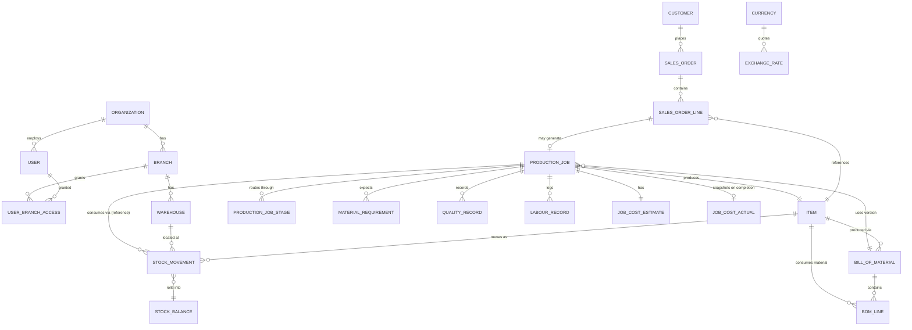

# Manufacturing Operations Intelligence Platform — Phase 0: Architecture Discovery

Status: **DRAFT — awaiting approval. No Phase 1 code has been written.**
Scope: Backend only, per your instruction. UI is out of scope except what's needed later to smoke-test the backend.

---

## 0. Inspection result — please read this first

I was not actually given the project zip or `package.json`. Only the spec text file (`PRODUCT_SPEC`) came through as an attachment; no archive or `package.json` is present in this session's uploads.

Everything below is built from your **stated** description of current state (Next.js 16, App Router, React 19, TypeScript, Tailwind 4, ESLint 9, nothing else installed, Windows 10, npm) rather than from inspecting real files. I have not verified this and I'm not going to pretend I did.

Two consequences:

1. **The 5 high-severity `npm audit` warnings**: I have no real audit output to analyze. I will not invent package names or CVE IDs — that would violate the same "never fabricate data" principle your spec itself mandates for the product. Run this and paste the output back to me:
   ```
   npm audit
   npm audit --json > audit-report.json
   ```
   Send me `audit-report.json` (or paste the text output) and I'll tell you exactly which packages, whether they're reachable in your actual usage (most high-severity advisories in a fresh `create-next-app` tree are in build-time/dev dependencies, not runtime), and the minimal-risk fix. I will not recommend `npm audit fix --force` blind, and neither should you — it can silently jump major versions of transitive deps.

2. Everything else in this document is architecture/design, which doesn't depend on inspecting your files — it depends on the spec, which I have in full. So Phase 0 can proceed. If you do attach the real zip later, I'll diff my assumptions against reality before Phase 1 starts, as Section 25 requires.

---

## 1. Recommended Architecture

**Modular monolith inside the existing Next.js app**, with a hard internal boundary between HTTP transport and business logic:

```
app/
  api/v1/...                  → thin route handlers (parse, authn/z, call module, map response)
  layout.tsx, page.tsx, ...   → Next.js App Router UI (routes/layouts/pages)
src/
  server/
    modules/
      iam/                    → org, branch, user, role, session, audit
      catalog/                → items (products/materials), units, BOM
      inventory/               → warehouses, stock movements, stock balances
      sales/                  → customers, sales orders
      production/              → production jobs, stages, quality
      costing/                 → job cost estimate/actual, currency, exchange rates
    shared/
      db.ts                   → Prisma client singleton
      authz.ts                → permission matrix, scope enforcement
      money.ts                → Decimal-safe money helpers (never float math)
      errors.ts                → typed domain errors → HTTP mapping
  lib/                        → cross-cutting, framework-agnostic utilities
prisma/
  schema.prisma
```

**Note on `app/` vs `src/`:** `app/` is the single Next.js App Router location — it holds both the API route handlers (`app/api/v1/...`) and all UI (layouts, pages, components) as the latter is built out in later phases. `src/server/` holds all business logic, authorization, database access, and module boundaries, and is deliberately *not* nested under `app/`: route handlers import from it, but it has zero Next.js imports in the other direction. There is exactly one App Router directory (`app/`); no `src/app/` exists or should be reintroduced.

**Why not a separate API service:** nothing in the spec needs independent scaling, independent deployment cadence, or a different runtime from the web tier yet. A separate service buys you network hops, a second auth story, and double the deployment surface, for zero benefit at this stage — pure technical debt against your own "no scope creep" principle. Section 23 explicitly prefers a modular monolith unless there's a demonstrated reason, and there isn't one yet.

**Why the module boundary still matters even though it's one deployable:** `server/modules/*` contains zero Next.js imports (no `NextRequest`, no `next/server`). Route handlers are a thin adapter layer. This means:
- Business logic is unit-testable without spinning up HTTP.
- If a module genuinely needs to become a separate service later (e.g., a heavy reporting/intelligence module in Phase 5+), it can be extracted without a rewrite — you're moving a folder, not re-architecting.
- It enforces "keep business logic out of UI components" and "validate at API/server boundaries" from Section 23 by construction, not by discipline alone.

This is a direct, justified trade-off call, not a default — flagging it because your instructions say to challenge weak defaults rather than follow them blindly: a pure "put everything in route handlers" approach would be faster to type the first week and materially worse by Phase 3.

---

## 2. Stack Recommendation (with trade-offs)

### 2.1 Next.js Route Handlers vs. separate API service
**Recommendation: Route Handlers**, as the module boundary above makes the "separate service later" door cheap to open if it's ever actually needed. Revisit only if a specific module has a real scaling/runtime reason (e.g., a long-running analytics job that needs a worker process — that's a job queue problem, not a reason to split the whole API).

### 2.2 PostgreSQL vs. MongoDB
**PostgreSQL. Not a close call.** Your spec repeatedly demands exactly what a relational/ACID engine is for and a document store is bad at:
- Immutable, auditable transactional ledgers with balances *derived* from rows (Section 8) — this is accounting-grade data; you want `NUMERIC` types, foreign keys, and multi-row transactions, not eventual consistency.
- Multi-step financial/inventory operations in a single transaction (Section 23) — Postgres gives you real ACID transactions across multiple tables natively; MongoDB multi-document transactions exist but are bolted on and are not where that engine's strengths are.
- Traceable provenance ("why is stock 450") — this is a join-and-aggregate problem (SUM over a movements table), which is what SQL is for.
- Check constraints, foreign key integrity, and `NUMERIC`/`DECIMAL` for money (never floating point) — all first-class in Postgres, all awkward-to-absent in MongoDB.

I note your other active projects use MongoDB (fleet platform) and Postgres/Prisma (Nnino Ceramics). I'm not defaulting to either for consistency's sake — this recommendation is made independently on this product's own requirements, and it happens to land on Postgres because the requirements genuinely call for it.

### 2.3 Prisma vs. Drizzle
Both are legitimate choices here; this is the closest call in the stack.

| | Prisma | Drizzle |
|---|---|---|
| Migrations | `prisma migrate dev` — fast, generates SQL for you, good diff output | You write/review SQL directly; more control, more upfront effort |
| Type safety | Excellent, generated client | Excellent, schema-first, closer to raw SQL types |
| Complex aggregation (ledger balances, cost rollups, window functions) | Needs `$queryRaw` escape hatches — fine, but it's a secondary path | First-class — Drizzle's query builder *is* close to SQL, so this is the primary path |
| Team onboarding (you said you're on a team) | Very large ecosystem, most new hires already know it | Smaller ecosystem, steeper ramp for devs who haven't used a SQL-first ORM |
| Runtime weight | Heavier client, Rust query engine binary | Lighter, pure TS/JS |

**Recommendation: Prisma**, for the first slice through roughly Phase 3, specifically because:
- `prisma migrate dev` meaningfully speeds up the Phase 1→4 iteration you're about to do solo-then-team.
- Team onboarding cost is real and Prisma's ecosystem/docs lower it.
- The genuinely SQL-heavy pieces — stock balance derivation, cost rollups, variance calculations — I'm designing as **Postgres views / `$queryRaw` with parameterized SQL**, not as Prisma's ORM query builder. That gets you Drizzle's main advantage (transparent, auditable SQL for the parts where it matters most) without taking on a second ORM's learning curve for everything else.

If, once you're deep in Phase 4/5 reporting, the `$queryRaw` escape hatch starts feeling like the majority of the codebase rather than the exception, that's the signal to reconsider — not a decision to make now.

### 2.4 Authentication
**Recommendation: custom, Postgres-backed session auth** (not NextAuth/Auth.js, not a hosted provider like Clerk/WorkOS).

Why not NextAuth: its core design center is OAuth/social providers. Your actual requirement is credentials login + a session payload that must carry `{ orgId, branchAccess[], role }` and be **immediately revocable** when a role or branch grant changes (a real security requirement here — if you demote someone mid-shift, their existing session shouldn't keep working). Doing that well inside NextAuth means fighting its adapter model; you end up building most of the custom logic anyway while carrying the dependency.

Why not a hosted provider (Clerk/WorkOS/Auth0): per-MAU pricing in USD is a real cost/forex concern for a Zimbabwe SMB product, plus it adds a third-party dependency in the auth-critical path for a market where connectivity to external services can't always be assumed. Not disqualifying forever, but not justified for V1.

Design:
- `bcrypt`/`argon2id` password hashing (argon2id preferred — it's the current OWASP recommendation).
- Sessions stored server-side (`sessions` table), referenced by an opaque random token in an `httpOnly`, `Secure`, `SameSite=Lax` cookie — not a JWT. This is what makes instant revocation possible (delete the row / flip `revoked_at`); a self-contained JWT can't be revoked without an extra denylist, which is just a sessions table with more steps.
- Every authenticated request resolves `{ userId, orgId, role, branchIds[] }` from the session row, not from a client-supplied token — this is the single choke point server-side authorization in Section 2.4 of the spec depends on.
- Password reset / invite flows: deferred to Phase 1 implementation detail, not a Phase 0 architecture question.

---

## 3. Domain Model

### 3.1 Architecture decision flagged for your approval: unify Product and InventoryItem

The spec describes Products (Section 6: SKU, selling price, BOM) and Inventory categories (Section 8: raw material, WIP, finished goods, consumables, spare parts) as if separate, but a "finished good" in inventory **is** a Product. Modeling them as two disconnected tables creates exactly the kind of dual-source-of-truth problem your spec is trying to eliminate elsewhere (stock_quantity vs. ledger).

**Recommendation:** one `Item` table with an `item_type` enum (`raw_material | consumable | spare_part | finished_good | wip`). Product-only fields (`selling_price`, `is_sellable`) are nullable and only populated for sellable types. BOM lines, stock movements, and sales order lines all reference `Item` uniformly.

This is listed again under Section 9 (Questions) because it's a real deviation from the spec's literal section split and I want your explicit sign-off before it's load-bearing in the schema, not because I think it's a close call technically.

### 3.2 Core entities

**Tenancy / IAM**
- `Organization` — the tenant. `base_currency`.
- `Branch` — belongs to Organization.
- `User` — belongs to Organization.
- `UserBranchAccess` — join table (user_id, branch_id). Owner/Admin role implicitly has all-branch access (flagged as an assumption in Section 9); every other role requires explicit grants.
- `Role` — **fixed enum**, not a DB-configurable permission system, for V1: `OWNER_ADMIN, OPERATIONS_MANAGER, PRODUCTION_MANAGER, INVENTORY_MANAGER, PRODUCTION_OPERATOR, FINANCE_MANAGER, VIEWER`. The capability matrix (which role can do what) lives in code (`server/shared/authz.ts`), not a `permissions` table. This is a direct application of your spec's own instruction not to build unnecessary permission flexibility until a real requirement exists (Section 4). Extending to a full RBAC/permission-table system later is additive, not a rewrite.
- `AuditLog` — polymorphic: `entity_type, entity_id, org_id, branch_id, actor_user_id, action, before (jsonb), after (jsonb), reason, created_at`. Append-only, no updates/deletes.

**Currency**
- `Currency` — code, decimals (e.g., USD=2). Seeded: USD, ZIG, ZAR.
- `ExchangeRate` — `base_currency, quote_currency, rate, as_of_date, source, recorded_at`. **Append-only** — a new rate is a new row, never an UPDATE. Every monetary amount elsewhere stores its own `currency_code`; any cross-currency rollup stores the specific `exchange_rate_id` it used, so a report generated today and the same report regenerated in a year produce the same number. `source` exists specifically because Zimbabwe commonly has more than one quotable rate (see open question in Section 9).

**Catalog**
- `Item` — unified product/material (see 3.1). `sku, name, description, uom, item_type, selling_price, selling_price_currency, is_active`.
- `BillOfMaterial` — `product_item_id, version, status (draft/active/superseded), effective_from`. Versioned; never mutated once active — a BOM change creates a new version.
- `BomLine` — `bom_id, material_item_id, quantity, uom`.

**Sales**
- `Customer` — `name, contact, address, status, notes`.
- `SalesOrder` — `order_number, customer_id, branch_id, status, currency, requested_delivery_date`.
- `SalesOrderLine` — `sales_order_id, item_id, quantity, unit_price, currency`.

**Production**
- `ProductionJob` — `job_number, branch_id, sales_order_line_id (nullable — see Section 9), product_item_id, bom_id (snapshot of the version used), planned_qty, planned_start, planned_end, actual_start, actual_end, status, quoted_amount, quoted_currency`.
- `ProductionStageTemplate` — per-product or org-default routing (e.g., Cutting → Assembly → Sanding → Painting → Quality → Packaging), ordered.
- `ProductionJobStage` — `job_id, stage_name, sequence, status, started_at, completed_at, operator_user_id, qty_processed, qty_rejected, notes, client_request_id (idempotency)`.
- `MaterialRequirement` — `job_id, material_item_id, expected_qty` — snapshotted from BOM × planned_qty **at job creation**, so a later BOM change never silently rewrites a historical job's expected consumption (direct requirement from Section 7).
- `QualityRecord` — `job_id, job_stage_id, produced_qty, accepted_qty, rejected_qty, reject_reason, notes, evidence_ref`.
- `LabourRecord` — `job_id, job_stage_id, user_id, hours, rate, rate_currency`.

**Inventory**
- `Warehouse` — `branch_id, name`. One per branch is the common case; not hardcoded to one.
- `StockMovement` — **immutable ledger**, append-only. `item_id, warehouse_id, movement_type, quantity (signed), unit_cost, currency, reference_type, reference_id, client_request_id (idempotency, unique), created_by, created_at, reason`.
- `StockBalance` — a maintained summary (`item_id, warehouse_id, quantity, updated_at`), **written in the same DB transaction as every StockMovement insert**, never independently editable. It's a performance cache over the ledger, not a second source of truth — a scheduled reconciliation job (`SUM(stock_movement.quantity) == stock_balance.quantity`) proves that at any time. This satisfies both "never bare stock_quantity" and the practical need to not re-sum the whole ledger on every read.

**Costing**
- `JobCostEstimate` — `job_id, estimated_material_cost, estimated_labour_cost, estimated_overhead_cost, currency, computed_at` — computed once at job creation from BOM × standard costs.
- Actual cost is **derived, not stored**, while a job is in progress (a view over `StockMovement` + `LabourRecord` filtered by `reference = job`), and **snapshotted** into `JobCostActual` only when the job is marked complete — matching "never silently change historical production calculations" while avoiding a second mutable source of truth for an in-progress job.
- Overhead: **explicitly unavailable unless you define an allocation method.** I have not invented one (see Section 9) — the spec is explicit that unavailable data must be shown as unavailable, not estimated silently.

### 3.3 Entity Relationship Map



(Rendered as Mermaid for portability — paste into any Mermaid viewer, e.g. the Mermaid Live Editor, if your tooling doesn't render it inline.)

---

## 4. Core Workflows

**A. Quote → Job → Cost (the first-slice workflow, see Section 7)**
1. Customer agrees a price for a job (either via a `SalesOrderLine` or a direct `quoted_amount` on the job — see open question).
2. `ProductionJob` created → snapshots active `BillOfMaterial` version → `MaterialRequirement` rows generated (expected qty per material) → `JobCostEstimate` computed from BOM × current standard material costs + (optionally) a standard labour estimate.
3. Materials issued to the job → each issue is a `StockMovement(movement_type=production_consumption, reference=job)`, atomically decrementing `StockBalance`.
4. Labour logged → `LabourRecord` rows.
5. Job marked complete → quality recorded (`QualityRecord`) → actual cost computed from the sum of consumption movements + labour → `JobCostActual` snapshot written, immutable from then on.
6. Quote vs. actual vs. margin is now a direct, explainable read.

**B. Material issue with offline tolerance**
1. Shop-floor client generates a `client_request_id` (UUID) locally when the operator taps "issue material," before any network call.
2. The write (stage start/complete, material issue, quality record) is queued locally if offline.
3. On sync, `POST` includes `client_request_id`. The server has a **unique constraint** on that column per table. A retried/duplicate sync is a no-op that returns the original row — never a double-posted stock movement or duplicate quality record.
4. Server records both `occurred_at` (client-asserted, for shop-floor ordering) and `synced_at` (server receipt time, authoritative for audit) — so late-arriving offline events don't corrupt the audit timeline.

**C. BOM change does not rewrite history**
A new `BillOfMaterial` version is created (never an UPDATE on an active one). Jobs already created continue to reference the specific version they snapshotted at creation (`ProductionJob.bom_id`). New jobs pick up the new active version.

---

## 5. State Machines

**SalesOrder**: `draft → confirmed → in_production → partially_delivered → delivered → closed`, with `cancelled` reachable from `draft` or `confirmed` only.

**ProductionJob**: `planned → released → in_progress → completed → closed`, with `on_hold` reachable from `released`/`in_progress`, and `cancelled` reachable from `planned`/`released` only (not from `in_progress` — a job with material already consumed can't simply vanish; it must be completed or explicitly written off, which is an inventory adjustment, not a job-status change).

**ProductionJobStage**: `pending → in_progress → completed`. A stage cannot start until the job is `released`/`in_progress`; a job cannot move to `completed` until its final configured stage is `completed`.

**StockMovement**: no state machine — it's an immutable event, not an entity with lifecycle. (This is intentional: movements don't get "edited," a correction is a new offsetting movement with `movement_type=adjustment` and a `reason`, preserving full history.)

---

## 6. Organization / Branch / Permission Model

- `Organization → Branch → User (via UserBranchAccess) → operational data`, exactly as Section 2.4 specifies.
- Every table holding operational data carries both `org_id` and `branch_id` (nullable `branch_id` only where genuinely org-wide, e.g. `Customer` if you decide customers are shared across branches — flagged in Section 9).
- **No fallback, ever**: every repository function in `server/modules/*` takes a mandatory `scope: { orgId: string; branchId?: string }` argument threaded from the resolved session — never optional-and-silently-ignored. If a query needs branch scope and none is resolvable, it throws rather than widening to org-level. This is the literal implementation of "never introduce organization-wide fallback when branch scope is missing."
- Role → capability matrix, hardcoded in `authz.ts` for V1 (see 3.2). Example shape:
  ```ts
  const CAPABILITIES: Record<Role, Capability[]> = {
    OWNER_ADMIN: ['*'],
    PRODUCTION_MANAGER: ['job:create', 'job:update', 'stage:transition', 'quality:record', ...],
    PRODUCTION_OPERATOR: ['stage:transition', 'quality:record'],
    // ...
  };
  ```
- **Defense-in-depth flag (not blocking Phase 0 approval):** Postgres Row-Level Security (`SET app.current_org_id`) is worth adding in Phase 1/2 as a second layer under the application-level scoping above, so a bug in one repository function can't leak cross-tenant data even if the mandatory-scope discipline is violated somewhere. Listed as a Phase 1 hardening backlog item, not a Phase 0 blocker.

---

## 7. Inventory Transaction Model

Already detailed in 3.2 (`StockMovement` / `StockBalance`), restating the core rule explicitly since it's the one your spec is most emphatic about:

- `StockBalance.quantity` is **never written directly** by any application code path except the one internal function that also writes the corresponding `StockMovement`, in the same DB transaction.
- "Why is stock 450?" is always answerable: `SELECT * FROM stock_movement WHERE item_id = ? AND warehouse_id = ? ORDER BY created_at`, and `SUM(quantity)` over that set must equal `StockBalance.quantity` at all times — this is a testable invariant, not just a design intention, and should be a standing integration test from Phase 2 onward.
- Movement types: `purchase_receipt, material_issue, material_return, production_consumption, finished_goods_receipt, sale_delivery, adjustment, stock_transfer_out, stock_transfer_in` — matching Section 8 exactly, modeled as an enum, each with a defined sign convention (receipts/returns positive, issues/consumption/sales negative, transfers paired across two warehouse rows).

---

## 8. Production Job Model

Covered in 3.2 / Section 4. Key design point worth restating: the job carries a **snapshot** of its BOM version and its `MaterialRequirement` (expected quantities) at creation time — both are copies, not live references — so historical jobs remain accurate forever even as the product's BOM evolves. Actual consumption, labour, and quality are all recorded against the job via its own child tables, never by mutating the job row's totals directly.

---

## 9. Costing Model

Covered in 3.2 / Section 4. Restating the provenance rule because it's the one most likely to be gotten wrong under time pressure: every cost figure shown to a user must either be (a) a direct sum of source rows with a visible query path, or (b) an explicit "unavailable" / "not yet calculated" state — never a plausible-looking number with no row backing it. Overhead is `unavailable` until you decide an allocation method (see Risks below); I have deliberately not invented one.

---

## 10. Proposed Database Schema

See `prisma/schema.prisma` and `docs/schema.sql` in this delivery — full DDL, not just a description. Tables are annotated `-- FIRST SLICE` or `-- LATER PHASE` so you can see exactly what Section 11 below actually needs to stand up today versus what's modeled now but not built yet.

---

## 11. First Slice — Job Costing (thin, value-early)

**Goal:** quote vs. actual vs. profit per job, end to end, on real data — nothing else.

**Minimum tables** (full set is in the schema; this is the subset with data actually flowing through it in the first slice):
`organization, branch, user, session, user_branch_access, currency, exchange_rate, customer, item, bill_of_material, bom_line, production_job, material_requirement, warehouse, stock_movement, stock_balance, labour_record, job_cost_estimate, job_cost_actual, audit_log`.

Deliberately **not** in the first slice: `sales_order`/`sales_order_line` (see open question below — a job can carry `quoted_amount` directly for now), `production_job_stage`/`production_stage_template` (first slice tracks job-level consumption/completion, not stage-by-stage shop-floor routing — that's the next slice after this one proves out), `quality_record` (reject tracking is valuable but not required to compute quote-vs-actual-cost), suppliers/procurement (Phase 6, untouched).

**Minimum endpoints:**
```
POST   /api/v1/auth/login
POST   /api/v1/auth/logout

GET    /api/v1/customers
POST   /api/v1/customers

GET    /api/v1/items
POST   /api/v1/items
POST   /api/v1/items/:id/boms              (create new BOM version)
GET    /api/v1/items/:id/boms/active

POST   /api/v1/production-jobs             (creates job, snapshots BOM, computes estimate)
GET    /api/v1/production-jobs/:id
POST   /api/v1/production-jobs/:id/stock-movements   (idempotent — material consumption)
POST   /api/v1/production-jobs/:id/labour             (idempotent)
POST   /api/v1/production-jobs/:id/complete            (snapshots JobCostActual)
GET    /api/v1/production-jobs/:id/cost                (estimate vs actual vs margin)

GET    /api/v1/stock-balances?itemId=&warehouseId=

GET    /api/v1/exchange-rates/latest?base=&quote=
POST   /api/v1/exchange-rates               (Finance/Admin only)
```

That's roughly 16 endpoints and 20 tables (several of which are tiny: `currency`, `warehouse`) to get a real, auditable, multi-currency, idempotent job-costing slice working — not a toy. Everything else in the full spec builds on this foundation without reworking it.

---

## 12. Frontend Route Structure (for later — not building UI now)

Noted for forward-compatibility only, so the API boundaries above don't accidentally assume a UI shape that doesn't fit:

```
/login
/dashboard
/customers, /customers/[id]
/catalog/items, /catalog/items/[id]/bom
/production/jobs, /production/jobs/[id]            ← first slice's actual surface
/production/jobs/[id]/cost
/inventory/stock
/settings/users, /settings/branches
```

Per your instruction, nothing under this gets built until the backend slice above is verified — at most a bare page to exercise the API during Phase 1 smoke-testing.

---

## 13. Phase-by-Phase Plan (restated against your Section 24, with the first slice inserted)

- **Phase 0 (this document)** — approve or correct, no code yet.
- **Phase 1 — Foundation**: auth, organization/branch/user/role, audit log, the module-boundary skeleton itself.
- **Phase 1.5 — First Slice (new, thin)**: catalog + BOM + production job + stock ledger + labour + job costing, exactly as scoped in Section 11. This is the earliest point at which the product does something a real workshop owner would pay for.
- **Phase 2 — Products + Inventory (full)**: the rest of Section 8 — stock transfers, adjustments, full warehouse model, multi-item BOM edge cases.
- **Phase 3 — Orders + Production (full)**: `SalesOrder`, `ProductionJobStage`/shop-floor routing, operator workflow.
- **Phase 4 — Quality + Cost (full)**: `QualityRecord`, reject trends, overhead allocation once you've decided a method.
- **Phase 5 — Management Intelligence**: dashboard, evidence-backed anomalies, reports — only once Phases 1–4 have produced real data to be intelligent about.
- **Phase 6 — Procurement.**
- **Phase 7 — Advanced Operations.**

---

## 14. Risks & Ambiguities

- **Item/Product unification** (Section 3.1) is a real deviation from the spec's literal structure. Technically sound, but it's your call — flagged, not assumed.
- **Offline window is undefined.** Idempotency keys handle *duplicate* sync safely, but if shop-floor devices can be offline for days rather than hours, you may eventually need a fuller outbox/event-log pattern on the client, not just idempotent endpoints. Not a Phase 0 blocker — just don't be surprised if "a few hours" turns out to mean "a weekend with no signal" in practice and the client-side queuing needs to be more robust than a simple retry queue.
- **ZiG rate volatility and multiple concurrent rate sources** (official vs. parallel-market) is a real business question, not a technical one — see Section 15.
- **Overhead allocation method is completely undefined by the spec**, intentionally — I have not guessed one. Job costing will show overhead as `unavailable` until you decide.
- **Labour costing method is unspecified** — hourly rate per operator? Per-role standard rate? Flat per-stage? This directly shapes the `LabourRecord` schema's rate source.
- **Does `Owner/Admin` get implicit all-branch access, or must even Owner have explicit grants?** I've assumed implicit, and it's a reasonable default, but it's load-bearing in the authz code so it deserves an explicit yes.
- **Is `Customer` org-wide or branch-scoped?** A customer with one branch is trivial; a customer who orders from two branches of the same org is a real multi-branch question once you grow past one site.
- **Evidence storage for quality rejects** ("preserve the reason and evidence" — Section 13 of the spec) implies photo/file attachments eventually, which means an object storage decision (S3-compatible — Cloudflare R2 or Backblaze B2 are the cost-sensible options for a Zimbabwe-based product). Not needed for the first slice; flagging now so it's not a surprise in Phase 4.

---

## 15. Questions Requiring a Product Decision (not invented, not guessed)

1. **Item/Product unification** — approve the single `Item` table with `item_type`, or do you want Products and InventoryItems kept as genuinely separate tables (duplicating shared fields, needing a join/sync between a Product and its corresponding finished-good inventory record)?
2. **First-slice quoting** — can a `ProductionJob` carry its own `quoted_amount`/`quoted_currency` directly for the first slice (skipping `SalesOrder` entirely until Phase 3), or do you need a minimal `SalesOrder` even in the first slice?
3. **Exchange rate sourcing** — do you need to support multiple concurrent rate *sources* (e.g., official RBZ rate and a market/parallel rate simultaneously), with the user choosing which applies per transaction? Or is a single rate feed sufficient for V1?
4. **Owner/Admin branch access** — implicit all-branches, or explicit grants even for Owner/Admin?
5. **Customer scope** — org-wide, or branch-scoped?
6. **Labour costing basis** — per-operator rate, per-role standard rate, or flat per-stage estimate? This has to be answered before `LabourRecord`'s rate column means anything.
7. **Overhead allocation method** — do you want this deferred entirely to Phase 4 (my default assumption), or do you already have a method in mind (e.g., % of labour cost, % of material cost, fixed cost per job) that should be modeled now even if not computed until later?
8. **Offline duration expectation** — rough order of magnitude (minutes, hours, a full day) for how long a shop-floor device might realistically be disconnected, so the client-side sync design (not covered in this backend-only Phase 0) is sized correctly later.

I have not defaulted any of these into the schema in a way that would be costly to reverse — items 1 and 2 are the two that actually touch table structure, and both are called out explicitly above rather than silently assumed.

---

## 16. Phase 0 Addendum — Approved Revisions (2026-10-06)

Phase 0 was approved with 9 required changes and answers to 5 of the 8 open questions above (items 2, 3, 6, 7, 8 remain open — see the "status" column). This section is the permanent record of what changed and why; `schema.sql`, `db-roles-and-security.sql`, and `schema.prisma` all carry inline comments pointing back here.

### Answers to Section 15 questions

| # | Question | Answer | Effect |
|---|---|---|---|
| 1 | Item/Product unification | **Yes** — keep the single `Item` table | No schema change; confirms what was already built |
| 2 | First-slice quoting via bare `ProductionJob.quoted_amount` | **Yes** — skip `SalesOrder` for the first slice | First slice (Section 11) can proceed without a `SalesOrder` dependency |
| 3 | Exchange rate sourcing | **Single source, with a `source` column recorded per rate** | `exchange_rate.source` is a real enum (`RBZ_OFFICIAL`/`MARKET`/`MANUAL`), not a free-text field — one row can still be tagged by source even though only one is "live" at a time |
| 4 | Owner/Admin branch access | **Implicit all-branch access** | Authz layer (Phase 1) must special-case `OWNER_ADMIN` to bypass `user_branch_access` entirely rather than requiring grant rows — documented in Section 4 and enforced in `server/shared/authz.ts` |
| 5 | Customer scope | **Org-wide** | `customer` has no `branch_id`; already reflected in `schema.sql`/`schema.prisma` |
| 6 | Labour costing basis | **Per-operator rate** | *Open for schema shape* — `labour_record.rate`/`rate_currency` is captured per record (not a shared rate table) so a per-operator rate can be attached at write time; the rate *source* (where the per-operator number comes from — a user-entered field vs. a lookup table) is still a Phase 1.5/2 implementation decision, not a Phase 1 blocker |
| 7 | Overhead allocation method | **Deferred** | `job_cost_estimate.estimated_overhead_cost` / `job_cost_actual.actual_overhead_cost` stay nullable; no allocation logic exists anywhere yet |
| 8 | Offline duration expectation | **Pending** | No schema impact either way — idempotency keys are duration-agnostic. Flagged again here so it isn't lost: this still needs an answer before the shop-floor client sync design starts (outside this backend's Phase 0 scope) |

### The 9 required changes

1. **`gross_profit` removed from the Prisma model.** `job_cost_actual` keeps `gross_profit` as a Postgres `GENERATED ALWAYS AS (...) STORED` column in `schema.sql` only. `schema.prisma`'s `JobCostActual` model has no `grossProfit` field at all — not `Unsupported`, not commented out, simply absent — so there is no path by which Prisma Client could ever attempt to write it. Reads go through `$queryRaw`. *Why not model it as an `Unsupported(...)` field instead:* that would still require every `SELECT` through Prisma Client to either exclude it manually or fail on the unsupported type; omitting it entirely from the model removes the footgun completely at the cost of one raw-query helper (`server/modules/costing/job-cost-queries.ts`, Phase 4).

2. **`citext` replaced with a lowercase CHECK.** `app_user.email` is `text NOT NULL` with `CHECK (email = lower(email))`. The application is the single place that lowercases on write and on every lookup comparison (`server/shared/db.ts` helpers normalize before any query touches `email`). Rejected `citext` for three reasons: it's a non-core extension that has to be installed per-database (one more manual setup step and failure mode on a user's own Postgres instance), its collation/locale interaction with indexes has known surprises, and a plain CHECK plus app-level normalization gives the exact same guarantee with zero extension dependency.

3. **Prisma version/setup verified against current docs, not memory.** Confirmed Prisma ORM 7 defaults to the `prisma-client` generator (not `prisma-client-js`), requires an explicit `output` path, and requires a driver adapter (`@prisma/adapter-pg`) plus a `prisma.config.ts` file at the project root — these aren't optional stylistic choices, Prisma 7 will not run without them. Also confirmed and pinned the exact `prisma`/`@prisma/client` version pair (`7.10.0`/`7.10.0`) after finding the `prisma` CLI package's `latest` npm dist-tag resolves to an `8.0.0` release candidate while `@prisma/client`'s `latest` is still `7.10.0` — an unpinned `npm install prisma @prisma/client` would have silently installed a CLI major version ahead of the client, a mismatch Prisma explicitly warns breaks migrations in subtle ways.

4. **All status/type fields are real enums or CHECK-backed, both schemas.** `schema.sql` gained CHECK constraints on `production_job.status`, `production_job_stage.status`, `stock_movement.reference_type`, `audit_log.action`, and `exchange_rate.source` (previously plain `text`). `schema.prisma` gained matching native Prisma enums (`ProductionJobStatus`, `ProductionJobStageStatus`, `ReferenceType`, `AuditAction`, `RateSource`) plus the enums that already existed for other fields. One deliberate exception: `audit_log.entity_type` stays free-text in both schemas — it names a table/aggregate (`production_job`, `item`, `user_branch_access`, ...), and a closed enum would require a migration every time a new auditable entity type is added, which defeats the point of an audit log that should never be the thing blocking a new feature.

5. **Idempotency uniqueness is `(org_id, client_request_id)`, not globally unique.** A client-generated UUID is only guaranteed unique within the device/session that generated it; making it globally unique across tenants would let one organization's retried request collide with an unrelated organization's legitimately-reused UUID space (vanishingly unlikely with UUIDv4, but "unlikely" is not the right bar for a constraint that silently drops a different tenant's data). The composite constraint also means tenant isolation holds even in the pathological case. Applied to `stock_movement`, `labour_record`, `production_job_stage`, and `quality_record`.

6. **Separate migration-owner and runtime DB roles, plus immutability triggers.** `db-roles-and-security.sql` creates `mops_migrator` (owns the schema; the only role that ever runs `prisma migrate`) and `mops_runtime` (the application's connection; `SELECT`+`INSERT` only on `stock_movement`/`audit_log`/`exchange_rate`/`job_cost_actual`, `SELECT`-only on `stock_balance`, full CRUD elsewhere). This alone would stop the application from issuing `UPDATE`/`DELETE` on the four immutable tables, but a second, independent layer — a `prevent_mutation()` trigger — was added and verified to block `UPDATE`/`DELETE` even for `mops_migrator`, the table owner, who otherwise has implicit mutation rights that GRANTs alone don't restrict. Defense in depth: a future migration that accidentally grants more than it should, or a one-off `psql` session as the migrator role for "just this once," still can't mutate ledger history.

7. **`org_id` consistency via composite FKs; `branch_id` added to `stock_movement`.** Every child table now carries its own `org_id` and a composite foreign key of the shape `FOREIGN KEY (org_id, parent_id) REFERENCES parent (org_id, id)`, which makes it a database-level constraint violation — not an application bug waiting to happen — to attach, say, Org B's `item_id` to an Org A `stock_movement` row. `stock_movement.branch_id` is denormalized from `warehouse.branch_id` and cross-checked by the insert trigger (Finding below) rather than trusted from the caller. Row-Level Security (RLS) was considered as a further layer and deliberately deferred — see the note at the end of `db-roles-and-security.sql` — because composite FKs plus mandatory application-level scope-threading already close the immediate gap, and RLS policies interact with the `SECURITY DEFINER` trigger function in ways that need their own dedicated design pass rather than being bolted on here.

8. **Cost aggregation never sums mixed currencies.** The old single `job_cost_actual_live` view was split into `job_material_cost_live` and `job_labour_cost_live`, both `GROUP BY ... currency`, returning one row per `(job_id, currency)` rather than a single number that silently summed USD and ZiG together. Any later rollup to a single number is an explicit, auditable conversion step using a recorded `exchange_rate_id` — never an implicit sum.

9. **Weighted-average inventory valuation; negative stock blocked by default.** Both are enforced inside `trg_stock_movement_before_insert()` (full listing in `schema.sql`), which recomputes `stock_balance.average_unit_cost` on every receipt and blocks any movement that would take `quantity` below zero, raising an exception rather than allowing it. The trigger also refuses to average a new receipt into an existing cost basis denominated in a different currency (ties back to revision #8).

### Finding from verification — `SECURITY DEFINER` was required, not optional

While verifying `trg_stock_movement_before_insert()` against a real Postgres instance connected **as `mops_runtime`** (not as superuser — testing under the actual least-privilege application role was the point), every `INSERT` on `stock_movement` failed with `permission denied for table stock_balance`. Root cause: `mops_runtime` is deliberately granted only `SELECT` on `stock_balance` (revision #6), but the trigger function needs to `SELECT ... FOR UPDATE` and then `UPDATE` that table to maintain the running balance. A plain PL/pgSQL function defaults to `SECURITY INVOKER` — it runs with the privileges of whichever role fired it, not the privileges of whoever defined it — so the function failed exactly as a correctly-configured least-privilege role should fail against an under-specified function.

The fix is `SECURITY DEFINER SET search_path = public` on the function signature, which makes it run with the privileges of its owner (`mops_migrator`, which does have full rights on its own schema) regardless of the calling role, while the `SET search_path` guards against the well-known `SECURITY DEFINER` search-path-hijacking class of bug. This is called out explicitly here because it is exactly the kind of bug that "looks right" when tested as superuser and only surfaces under the real runtime role — which is why the verification was done against `mops_runtime` specifically rather than treated as optional. After the fix, a full clean rebuild (drop role/DB, recreate via all 3 stages of `db-roles-and-security.sql`, reseed, rerun the full test suite including the originally-failing cases) passed end to end.

### Known verification gap — Prisma CLI could not be executed in this environment

Every invariant above (weighted-average costing, negative-stock blocking, currency-mix blocking, org-consistency composite FKs, branch/warehouse consistency, composite idempotency, the four immutability triggers, the email CHECK) was verified by connecting directly to a real local PostgreSQL 16 instance via `psql`, running the DDL in `schema.sql` and `db-roles-and-security.sql` exactly as written, and exercising it as the actual `mops_runtime` role with a dedicated test suite. That caught the `SECURITY DEFINER` bug above.

What was **not** verified in this environment: actually running `npx prisma migrate dev` against `schema.prisma`. This sandbox's outbound network allowlist blocks `binaries.prisma.sh`, which the Prisma CLI must reach to download its query/schema engine binaries — confirmed by direct inspection of the proxy's rejection log, not merely inferred from a failed command. `PRISMA_ENGINES_CHECKSUM_IGNORE_MISSING=1` does not help; it skips checksum verification, not the fetch itself. `prisma validate` and `prisma format` hit the identical block, since they also need the engine binary.

Practical effect: `schema.prisma`'s hand-translation of the verified SQL design (enums, composite FKs, `@@unique` constraints, field types) has been checked line-by-line against the verified `schema.sql`, and the one real Prisma-specific correctness bug this process caught — `@default(uuid())` not producing a database-level `DEFAULT` on Postgres — was found and fixed (see the header comment in `schema.prisma`). But the actual migration SQL that `prisma migrate dev` will generate from this file has not been executed or inspected by me. **Action needed from you:** run `npx prisma migrate dev --name init` on your own machine (Setup step in `SETUP_COMMANDS.md`) and, if you'd like a second check, paste back the generated `migration.sql` from `prisma/migrations/*/migration.sql` and I'll review it against the hand-verified `schema.sql` before you run it against anything but a throwaway local database.

The same gap applies to the Phase 1 TypeScript code below: every import of the generated client (`src/server/shared/db.ts`, `src/server/modules/iam/audit-service.ts`) uses `"<output>/client"` as the import path — confirmed against two current Prisma v7 doc pages, not against an actual generated output, since `prisma generate` couldn't run here either. If your real output structure differs, it's a one-line import fix per file, and `tsc --noEmit` (or just `npm run dev`) will point at exactly which lines the moment you run it.

**What WAS independently verified for the Phase 1 code**, to close as much of that gap as possible without a working `prisma generate`: every `.ts` file in this delivery was run through a real `tsc --noEmit` (strict mode, `noUnusedLocals`/`noUnusedParameters`/`isolatedModules` all on — the same settings a default Next.js tsconfig uses) against the *real* `zod`, `pg`, `@node-rs/argon2`, `@prisma/adapter-pg`, `next`, and `prisma` packages at the pinned versions, plus a hand-written stub standing in only for the one piece that couldn't be installed (the generated Prisma client itself, built field-for-field from `prisma/schema.prisma`). This caught two real, worth-knowing-about issues that were fixed before delivery:
- `@node-rs/argon2`'s `Algorithm` enum is a TypeScript `const enum`; importing it directly (`Algorithm.Argon2id`) fails to compile under `isolatedModules`, which Next.js's SWC-based build turns on by default. Fixed in `shared/password.ts` by using the plain numeric literal with a comment, not the enum import.
- A narrower type-safety gap in `session-service.ts`'s use of `include: { user: true }` was checked and confirmed NOT a bug — real Prisma's generated types narrow `.user` to non-optional in that case, which the simplified stub initially didn't model, producing a false positive that was resolved by correcting the stub, not the application code.

This is real signal, not a substitute for actually running `prisma generate` + `tsc` against your own generated client — do that too, and treat any new error there as more trustworthy than this stub-based pass if the two ever disagree.

---

## 17. Phase 1 Implementation Notes (auth, org/branch/user/role, audit log, module skeleton)

What was built, scoped exactly to your instruction — "Phase 1 only (auth, org/branch/user/role, audit log, module skeleton)" — and nothing from the first slice (catalog, BOM, production, costing) or later phases:

- **`server/shared/*`** — cross-cutting primitives with no dependency on any module: `errors.ts` (typed `AppError` hierarchy), `scope.ts` (the `OrgScope`/`BranchScope` naming convention), `authz.ts` (role/capability matrix + `hasBranchAccess`/`assertBranchAccess`), `password.ts` (argon2id at OWASP-minimum parameters), `db.ts` (the one Prisma Client instantiation, wired to `RUNTIME_DATABASE_URL` only), `http.ts` (cookie helpers + `errorResponse`).
- **`server/modules/iam/*`** — `org-service.ts` (unauthenticated tenant bootstrap), `branch-service.ts` (branch CRUD-lite + access grant/revoke), `user-service.ts` (user CRUD-lite, returns a `SafeUser` projection that excludes `passwordHash` at the source rather than relying on every caller to strip it), `session-service.ts` (login/logout/validate — custom Postgres-backed sessions, not NextAuth), `session-guard.ts` (bridges HTTP cookie extraction to session validation), `audit-service.ts` (`recordAudit` internal helper + `listAuditLog` protected read path).
- **`app/api/v1/*`** route handlers: `organizations/bootstrap`, `auth/login`, `auth/logout`, `branches` (+ `[id]` deactivate), `users` (+ `[id]` role/deactivate, `[id]/branch-access` grant/revoke), `audit-log`. Every route is a thin wrapper — parse, call the service (which does its own authz + validation), map errors via `errorResponse`. No business logic or authorization check lives in a route handler itself.
- **Tests**: `server/modules/iam/__tests__/{tenant-isolation,branch-isolation,auth,audit}.test.ts`, run with Vitest directly against a real local Postgres (not mocked) — see SETUP_COMMANDS.md Section 8.

Two Phase 1 defaults were chosen where your approval notes didn't specify, called out here rather than buried in code comments alone:

1. **`user:update_role` is OWNER_ADMIN-only.** The approved capability tiers didn't specify who can change roles; since role changes are the one action with privilege-escalation potential, it's kept out of the `OPERATIONS_MANAGER` tier even though that tier otherwise manages users and branches. Covered by the auth test suite's privilege-escalation tests. Flag if you want this wider.
2. **Login requires an `organizationId` in the request body**, not just email+password. This follows directly from an already-approved constraint — `app_user.email` is unique per `(org_id, email)`, not globally — so the same email can legitimately exist in two unrelated orgs, and the login endpoint needs to know which org's row to check. This pushes a real product decision onto the actual login UI (how does a user indicate which org they're logging into — a per-org link, a subdomain, an org picker after an initial email lookup?) that Phase 1's backend scope doesn't resolve. Not a blocker for Phase 1 as delivered, but worth deciding before building a login *page*.

One schema-driven consequence worth naming explicitly: **branches and users can never be hard-deleted once they have any audit history**, which in practice is immediately (bootstrap alone writes 3 audit rows). This isn't a bug — `audit_log`'s foreign keys to `organization`/`branch`/`app_user` are `ON DELETE RESTRICT` by design (an audit trail must outlive the entities it describes) — but it does mean `branch-service.ts`/`user-service.ts` expose only `isActive` (soft delete), never a hard delete, and the isolation test suite's `test-helpers.ts` has no cleanup step for the same reason (see that file's header comment). Your dev database will accumulate organizations from both normal use and test runs; periodically dropping/recreating it (`SETUP_COMMANDS.md`) is the expected way to reclaim space, not a workaround for a defect.
