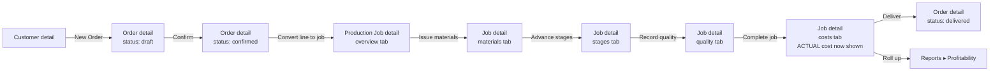

# Operis — Phase 2: UX/UI Architecture & Screen Specification

**Status:** Approved with changes (2026-10-07), capability table received and applied (2026-10-07). §15.1 is now resolved — `src/server/shared/authz.ts` ships with this revision. One small open point remains (`OPERATIONS_MANAGER` + `exchange_rate:create`, flagged in §15.1) and one hard dependency remains before any service code gets written: you confirming the §16.3 migration is applied and `tsc`/`vitest` are green against your actual tree (§16.5, step 2). Everything else in §15 is resolved.

**Grounded in:** `docs/ARCHITECTURE.md` Sections 3–11 (domain model, state machines, role/capability model, costing provenance rule). This document does not redefine any entity, state machine, or business rule from that file — where a UX decision depends on one, it is cited by section number, not restated or reinterpreted. Where I needed to extend the *capability model* (new `Capability` string values for modules that don't exist in `authz.ts` yet — catalog, production, inventory, costing all currently have zero capabilities defined) I've done so following the exact `resource:action` convention already in use, and flagged it in Section 15 rather than treating it as settled.

---

## 0. How to read this document

- Sections 1–12 map 1:1 to the brief's numbered deliverables.
- Section 13 names the minimum build-first screen set, per your instruction to implement a subset, not everything.
- Section 14 is an addition: a **data-availability map**. The backend's first slice (`ARCHITECTURE.md` §11) deliberately excludes `SalesOrder`, `ProductionJobStage`, `QualityRecord`, and any overhead-allocation method. A UX spec that ignores this would spec screens against data that doesn't exist yet. Every screen below states which parts render against real data today and which render an explicit "not yet available" state until a later phase ships — this is the direct UI expression of the provenance rule in `ARCHITECTURE.md` §9 ("never a plausible-looking number with no row backing it").
- Section 15 lists decisions that are mine to propose but yours to approve, same convention as `ARCHITECTURE.md` §15.
- "PLANNED / ACTUAL / CALCULATED / ESTIMATED / UNAVAILABLE" is used as a literal, consistent label vocabulary throughout — not five synonyms for "number." Defined precisely in §5.2 and used identically everywhere a figure appears.

---

## 1. Information Architecture

### 1.1 Primary navigation (persistent left sidebar, management roles)

```
OPERIS
├── Command Centre                 /dashboard
├── Orders                         /orders
│   └── [order]                    /orders/[id]
├── Production                     /production/jobs
│   ├── Board                      /production/board
│   └── [job]                      /production/jobs/[id]
├── Inventory                      /inventory
│   ├── Stock                      /inventory/stock
│   ├── [item]                     /inventory/items/[id]
│   └── Warehouses                 /inventory/warehouses
├── Catalog                        /catalog/items
│   └── [item] → BOM               /catalog/items/[id]/bom
├── Customers                      /customers
│   └── [customer]                 /customers/[id]
├── Quality                        /quality               (Phase 2+, see §14)
├── Reports                        /reports/profitability
└── Settings                       /settings
    ├── Users                      /settings/users
    ├── Branches                   /settings/branches
    └── Audit Log                  /settings/audit-log
```

This matches and extends `ARCHITECTURE.md` §12's forward-compatibility sketch exactly — `/dashboard`, `/customers`, `/catalog/items`, `/production/jobs`, `/inventory/stock`, `/settings/users`, `/settings/branches` are unchanged; I've added `/orders`, `/production/board`, `/inventory/warehouses`, `/quality`, `/reports/profitability`, `/settings/audit-log` because the brief asks for Orders, a Production Board, and Quality as first-class modules, and `audit_log:read` is already a real capability with no UI surface today.

### 1.2 Secondary navigation

Secondary nav is **in-page tabs**, not a second sidebar level — an information-dense operational tool should not force two levels of chrome to reach content. Pattern:

| Context | Tabs |
|---|---|
| Order detail | Overview · Lines · Production · Documents · Activity |
| Production Job detail | Overview · Materials · Stages · Quality · Costs · Activity |
| Item detail | Overview · BOM · Stock · Price History |
| Customer detail | Overview · Orders · Activity |
| Settings | Users · Branches · Audit Log |

### 1.3 Page hierarchy (depth, not breadth)

Three levels, maximum, from the sidebar:
`Module list → Record detail → Record sub-view (tab)`.
No fourth level. If a sub-view needs its own detail (e.g. a single stock movement inside a material's stock history), it opens in a **drawer** over the current page, not a new route — see §12.4. This keeps the back button predictable and keeps the breadcrumb trail at a maximum of 3 segments.

### 1.4 User journeys (the primary workflow, as navigation)

The brief's workflow — `Customer → Order → Production Job → Materials → Production → Quality → Cost → Delivery → Profitability` — is not a single screen; it is a *traversal* across six modules. The IA makes every step of that traversal a one-click forward link from the step before it, so the workflow is navigable without returning to a module list:



Every arrow in this diagram is a real forward action available from the preceding screen (a button, not a navigation detour) — e.g. "Convert to production job" is a button on an order line, not an instruction to go find the Production module and create one manually and link it back.

### 1.5 Relationships between modules

| From | To | Relationship | UI expression |
|---|---|---|---|
| Customer | Order | 1→many | "Orders" tab on customer detail, "New Order" button |
| Order Line | Production Job | 1→0..1 (`ARCHITECTURE.md` §3.2, nullable) | "Create job" action on an unconverted line; once converted, the line shows a link to the job instead of the action |
| Item | BOM | 1→many versions | "BOM" tab on item detail, shows active version with "Superseded versions (n)" collapsed |
| Production Job | Material Requirement / Stock Movement | 1→many | "Materials" tab: expected (from snapshot) vs. issued (from ledger), side by side |
| Production Job | Production Job Stage | 1→many, ordered | "Stages" tab: ordered list, matches `ProductionStageTemplate` routing |
| Production Job | Quality Record | 1→many | "Quality" tab |
| Production Job | Job Cost Estimate / Actual | 1→1 / 1→0..1 | "Costs" tab |
| Item | Stock Balance | 1→many (per warehouse) | Item detail "Stock" tab, one row per warehouse |

### 1.6 Role-specific navigation

Full sidebar is not shown to every role. Per `ARCHITECTURE.md` §6's capability model and the brief's explicit instruction ("Operators should receive a much simpler experience"), the sidebar is **filtered by capability presence**, not by a hardcoded per-role menu list — the nav component renders an item only if the signed-in user holds at least one capability that item's module exposes. This means adding a capability in `authz.ts` is the only change needed to surface a new nav item for a role; no second source of truth in the frontend. Concretely (capabilities proposed in §15.1):

| Role | Sidebar items shown |
|---|---|
| Owner/Admin | All |
| Operations Manager | All except Settings ▸ Audit Log edit actions (read-only there) |
| Production Manager | Command Centre, Orders (read), Production (full), Inventory (read), Catalog (Items read-only, BOM full — §15.1 refinement), Customers (read), Quality, Reports |
| Inventory Manager | Command Centre, Inventory (full), Catalog (Items full, BOM read-only — §15.1 refinement), Production (read, materials visibility only) |
| Production Operator | **Production Board + their assigned job detail only** — no sidebar at all, see §9.5 |
| Finance Manager | Command Centre, Orders (read), Reports (full), Costs on job detail, Settings ▸ Audit Log (read) |
| Viewer | Command Centre, everything read-only, no mutating action ever rendered (not just disabled — absent, so there's nothing to probe) |

---

## 2. Core Workflows

Each workflow below states: the **operational problem** it solves (per your instruction — every UX decision must trace to one), the **happy path**, and **what the UI does when something is wrong** (the brief's "what is going wrong" dimension, workflow by workflow rather than only in the Command Centre).

### 2.1 Creating a customer
**Problem:** a job and an order cannot exist without a customer; this must be fast enough to not interrupt order entry.
**Path:** Single-page form (name, contact, address, status, notes) reachable two ways: `/customers → New`, or inline from the order-creation screen as a "+ New customer" option inside the customer picker (a combobox, not a separate detour) so an unplanned walk-in order doesn't require abandoning the order flow.
**Failure state:** duplicate-name detection is a soft warning ("A customer named '…' already exists — use that one?"), never a hard block — contact names legitimately repeat.

### 2.2 Creating a product
**Problem:** a product is an `Item` with `item_type = finished_good` and sellable fields populated (`ARCHITECTURE.md` §3.1/3.2) — the UI must not expose this union type as raw plumbing.
**Path:** `/catalog/items → New` presents a type choice first (Finished good / Raw material / Consumable / Spare part / WIP) as large selectable cards, not a dropdown — this is the one field that changes which other fields appear (selling price only for sellable types), so it has to be answered before the rest of the form renders, and a card choice is unambiguous where a dropdown default could be submitted by accident.
**Failure state:** SKU uniqueness is checked on blur, not only on submit, so a collision surfaces before the rest of the form is filled.

### 2.3 Creating a BOM
**Problem:** BOMs are versioned and immutable once active (`ARCHITECTURE.md` §3.2, §4.C) — the UI must make "this creates a new version" an understood consequence, not a surprising one.
**Path:** From an item's BOM tab, "New version" opens a line editor seeded with a **copy** of the current active version's lines (so a minor tweak doesn't mean re-entering twenty lines). Explicit banner at the top: *"Saving creates Version N. Version N-1 stays active until you activate this one. Jobs already in progress keep using their original version."* This is a direct restatement of §4.C, inline where the decision is made, not buried in help text.
**Failure state:** a material line referencing an inactive/discontinued item is flagged inline, not silently accepted.

### 2.4 Receiving inventory
**Problem:** every stock change must be a `StockMovement` row (`ARCHITECTURE.md` §7) — there is no "edit stock quantity" anywhere in this UI, ever.
**Path:** `/inventory/stock → Receive`. Fields: item, warehouse, quantity, unit cost + currency, reference (free-text PO/supplier note — supplier module is Phase 6, not modeled yet, so this stays a text field, not a picker). Submission posts a `movement_type = purchase_receipt` row; the resulting `StockBalance` update is shown as a toast with the new balance, sourced from the same response — never a separate re-fetch that could show stale data.

### 2.5 Creating a sales order
**Problem:** an order is the commercial commitment that precedes production; it must support multiple lines against the unified `Item` catalog.
**Path:** `/orders → New` — customer picker, branch (defaulted to the user's active branch, changeable only if they hold multi-branch access per `ARCHITECTURE.md` §6), then a line-item table (item picker, qty, unit price pre-filled from `Item.selling_price` but editable, currency). Status starts at `draft` (`ARCHITECTURE.md` §5).
**Failure state:** an item with `is_active = false` cannot be added as a new line (filtered out of the picker, not merely warned about after selection).

### 2.6 Converting an order line into a production job
**Problem:** this is the one step in the whole workflow where a commercial commitment becomes a floor-level production commitment — it must snapshot the BOM, not reference it live (`ARCHITECTURE.md` §4.A step 2, §8).
**Path:** Button on an unconverted order line, "Create production job." Opens a confirmation panel showing: which BOM version will be snapshotted (the current active one — named explicitly, e.g. "Version 4, active since 12 Mar"), the planned quantity (defaulted to the line quantity), and planned start/end date pickers. Confirming calls the job-creation endpoint, which does the BOM snapshot + `MaterialRequirement` generation + `JobCostEstimate` computation server-side (`ARCHITECTURE.md` §4.A step 2) — the UI's job here is to show the *result* of that computation immediately (estimate total, by material) before the user navigates away, not to compute anything itself.
**Failure state:** if the product has no active BOM version, the button is disabled with a direct explanation ("This item has no active BOM — create one before converting this line"), linking straight to §2.3's flow.

### 2.7 Issuing materials
**Problem:** material issue is an idempotent, offline-tolerant action on the shop floor (`ARCHITECTURE.md` §4.B) — the UI must generate the `client_request_id` locally and must behave identically whether the network is up or not.
**Path:** On the job's Materials tab, each `MaterialRequirement` row shows expected vs. issued-so-far side by side with a progress bar; an "Issue" action opens a quantity entry (defaulting to remaining-expected) and warehouse picker. On tap/submit, a UUID is generated client-side before any network call; if offline, the action is queued (visible as a small "pending sync" badge on that row) and the optimistic UI shows the issued quantity immediately; on reconnect it posts with the same `client_request_id`, so a retried sync is a no-op server-side per §4.B.3 and the UI never double-counts even if a sync is retried.
**Failure state:** issuing more than the expected quantity is allowed (over-consumption happens) but shown in a distinct color (see §5.2 status palette) rather than blocked — the backend doesn't forbid it and the UI shouldn't invent a rule the domain model doesn't have.

### 2.8 Starting/completing production stages
**Problem:** stage sequencing is enforced by the state machine (`ARCHITECTURE.md` §5: `pending → in_progress → completed`, ordered) — the UI must make "you can't skip ahead" visible before the user tries, not as a rejected-request error after.
**Path:** Stages tab renders the ordered list from `ProductionStageTemplate`; only the first `pending` stage has an enabled "Start" button, every later stage is visibly disabled with "Waiting on: <previous stage name>." Completing a stage requires entering `qty_processed` and `qty_rejected` — both fields, every time, even when rejects are zero, so "zero rejects" is always a recorded fact, never an absence of data indistinguishable from "nobody checked."
**Failure state:** attempting to complete a stage with `qty_processed + carry > planned_qty` shows an inline warning but does not block — same reasoning as §2.7.

### 2.9 Recording output / 2.10 Recording rejects
Covered by §2.8 — output and rejects are not a separate screen; `qty_processed`/`qty_rejected` are mandatory fields on stage completion, and rejects additionally prompt for a reason. **Resolved (§15.2):** the reason picker is a fixed list — `wrong_dimensions`, `damaged`, `paint_defect`, `missing_component`, `other` (with a required free-text note when `other` is chosen) — which is not a new decision to implement: `prisma/schema.prisma`'s `RejectReason` enum already defines exactly this set. The UI simply surfaces the existing enum as a select; no schema change, no taxonomy invention.

### 2.11 Performing quality checks
**Problem:** `QualityRecord` is per-job-stage, not a bolt-on end-of-job gate (`ARCHITECTURE.md` §3.2).
**Path:** Quality tab lists one card per completed stage that has reportable output, each with accepted/rejected quantity entry and reject reason. This is deliberately **not** auto-populated from the stage-completion rejects field — a stage operator's "I made 3 rejects" and a quality inspector's formal accept/reject count are two different recorded facts in the domain model and the UI keeps them visually and structurally distinct rather than quietly merging them into one number.
**Failure state:** `accepted + rejected ≠ produced` is a hard validation error, not a warning — this one is arithmetic, not a judgment call, so it blocks submission.

### 2.12 Completing a production job
**Problem:** completion is the point where actual cost stops being a live derived view and becomes an immutable snapshot (`ARCHITECTURE.md` §3.2, §9) — this is the single highest-consequence button in the whole application.
**Path:** "Complete job" is gated behind a summary confirmation: final stage status, total issued materials cost, total labour cost, computed actual total — shown *before* the click commits, using the same derived-view numbers the Costs tab already shows live, so there's no surprise between preview and result. Requires the final configured stage to be `completed` (enforced by backend state machine, §5 — the button is simply disabled with an explanation otherwise, not a server round-trip to find out).
**Failure state:** none beyond the precondition above — once the precondition is met this is a terminal, non-reversible action and is treated as such (confirmation dialog, not a single click).

### 2.13 Calculating actual cost / 2.14 Viewing profitability
Covered in depth in §7 (Cost Intelligence) — not duplicated here.

### 2.15 Identifying inventory shortages
**Problem:** "what requires attention" for inventory means projected shortfall against open demand, not just a low raw number.
**Path (corrected per review):** Shortage = on-hand `StockBalance.quantity` minus **remaining** requirement, where remaining = `MaterialRequirement.expected_qty` minus the sum of `StockMovement.quantity` already issued against that requirement's job/item (`movement_type = production_consumption`, or `material_issue`, depending on which movement type the Phase 1.5 service settles on — see §16.4), summed across jobs not yet `completed`/`cancelled`. Using `expected_qty` alone (my original draft) overstates shortage for any job that has already issued materials — a job 80% issued should not weigh on the shortage calc as if none of it had moved. This is a **CALCULATED** figure (§5.2) built from real rows, not a guess — shown with its inputs visible on click (which jobs are drawing on this item, expected vs. issued per job) so "why is this short" is always answerable.
**Failure state:** an item with no `StockBalance` row yet for a warehouse (never received) shows "No stock recorded," not "0" — zero and unknown are different facts and the UI must not conflate them.

### 2.16 Investigating cost/material variance
**Problem:** variance is only trustworthy if its two sides are individually traceable.
**Path:** On the job Costs tab, every variance line (estimate vs. actual, by material and by labour) expands to the underlying rows — estimate expands to the BOM line × standard cost calculation, actual expands to the actual `StockMovement`/`LabourRecord` rows summed. No variance number is ever presented without this drill-down available, directly implementing §9's provenance rule at the UI level.

---

## 3. Command Centre

**Interim note (per review):** this section specs the *target-state* Command Centre, which needs `SalesOrder` and `ProductionJobStage` data that §16 confirms doesn't exist behind a service/route yet. Until Orders and Stages ship, this screen is **not** the landing page. The actual interim landing page is the Production Job List specified in §3.5 below, which uses only tables that are schema-complete today (`ProductionJob`, `JobCostEstimate`, `JobCostActual`). Build §13 against §3.5, not against §3.2–3.4.

### 3.1 Principle applied
Every tile answers one of the seven questions in the brief (what's happening / planned / actual / wrong / needs attention / cost / next action) using a figure traceable to source rows. No vanity metrics (no "total items in catalog," no decorative counters with no decision attached to them).

### 3.2 Layout

```
┌─────────────────────────────────────────────────────────────────────┐
│  Command Centre                                  [Branch: Harare ▾]  │
├───────────────────────┬───────────────────────┬─────────────────────┤
│ NEEDS ATTENTION (1st)  │ TODAY'S PRODUCTION     │ ORDERS THIS WEEK     │
│ • 3 jobs behind sched. │ 4 jobs in progress     │ 7 confirmed          │
│ • 2 items below        │ 1 on hold              │ 2 awaiting           │
│   reorder threshold*   │ 11 stages completed    │   confirmation       │
│ • 1 job: material      │                        │                      │
│   shortfall            │ [Open Production Board]│ [Open Orders]         │
├───────────────────────┴───────────────────────┴─────────────────────┤
│  COST & PROFITABILITY — JOBS COMPLETED THIS MONTH (n = 12)           │
│  USD: Est $x,xxx  Act $x,xxx  Margin xx.x%  (n=9)  [View report]     │
│  ZWG: Est z,xxx,xxx  Act z,xxx,xxx  Margin xx.x%  (n=3)               │
│  (grouped by currency per §7.0 — never blended; shown only for jobs  │
│   with both ESTIMATED and ACTUAL present — jobs with UNAVAILABLE     │
│   cost data are excluded and counted, not silently dropped:          │
│   "2 jobs excluded — cost not yet calculable")                       │
├───────────────────────────────────────────────────────────────────────┤
│  RECOMMENDED ACTIONS                                                  │
│  → Job #JOB-0231 is 2 days behind schedule — [Open job]               │
│  → Item "Pine board 25mm" is below reorder threshold — [Receive stock]│
│  → Order #SO-1042 confirmed 5 days ago, no job created yet — [Convert]│
└───────────────────────────────────────────────────────────────────────┘
```
*Reorder threshold is `Item.reorderThreshold`, approved in §15.3 but not yet migrated — see §16.3.

### 3.3 Tile-to-question mapping

| Tile | Business question answered | Data source |
|---|---|---|
| Needs Attention | What requires attention? | Union of: jobs with `planned_end < today AND status NOT IN (completed, closed)`; shortage calc (§2.15); jobs with any `MaterialRequirement` unmet |
| Today's Production | What is happening? | `ProductionJobStage` rows with `status = in_progress` today; job `status = on_hold` |
| Orders this week | What was planned? | `SalesOrder` rows by `status`/`created_at` |
| Cost & Profitability | What does it cost? | `JobCostEstimate`/`JobCostActual` for jobs `completed` this period |
| Recommended Actions | What should the user do next? | Derived list combining the above — each entry links directly to the action that resolves it, never a passive observation with no next step |

"What was planned / what actually happened" at the Command Centre level is the Orders and Production tiles read together (planned = confirmed orders / scheduled jobs; actual = in-progress/completed counts) rather than a seventh tile — a dashboard with a tile per brief bullet point would be exactly the "meaningless metric density" the brief warns against.

### 3.4 Attention-items and anomaly logic
"Anomaly" is deliberately **not** a statistical/ML concept here (brief: "Do not build AI features before the underlying operational data model is ready" — §14 confirms it isn't). Every anomaly in v1 is a rule evaluated against real rows: schedule slippage (`planned_end` passed, not completed), stock shortfall (§2.15), stale conversions (confirmed order, no job after N days — N configurable, defaulted sensibly, resolved in §15.4), cost overrun (actual tracking >X% over estimate mid-job, using the live derived view).

### 3.5 Interim landing page — Production Job List (build this now)

Per review: until Orders and Stages exist, the authenticated landing route (`/dashboard`) is this list, not §3.2's tile layout.

```
┌──────────────────────────────────────────────────────────────────────┐
│  Production Jobs                                   [Branch: Harare ▾]│
├──────────┬────────────┬───────────┬───────────┬──────────┬──────────┤
│ Job #    │ Product    │ Planned   │ Actual    │ Status   │ Cost      │
├──────────┼────────────┼───────────┼───────────┼──────────┼──────────┤
│ JOB-0231 │ Pine Bench │ 12–19 Mar │ 12 Mar– ⚠ │ On Hold  │ Est $532 USD│
│          │            │  PLANNED  │  (2d late)│          │ Act $475 USD│
│          │            │           │  ACTUAL   │          │ CALCULATED │
├──────────┼────────────┼───────────┼───────────┼──────────┼──────────┤
│ JOB-0229 │ Oak Desk   │ 10–15 Mar │ 10–14 Mar │ Completed│ Est $210 USD│
│          │            │  PLANNED  │  ACTUAL   │          │ Act $225 USD│
│          │            │           │           │          │ ACTUAL     │
└──────────┴────────────┴───────────┴───────────┴──────────┴──────────┘
```

- **Planned** column: `plannedStart`–`plannedEnd`, PLANNED label (§5.2).
- **Actual** column: `actualStart`–(`actualEnd` or "in progress"), ACTUAL label; a ⚠ renders when `plannedEnd` has passed and the job isn't `completed`/`closed` (the one piece of §3's "Needs Attention" logic that *is* buildable today, since it needs only `ProductionJob` fields — included here rather than held back for the full Command Centre).
- **Cost** column: estimate (`JobCostEstimate`, ESTIMATED) and live actual (CALCULATED, derived per `ARCHITECTURE.md` §9) or snapshotted actual (ACTUAL, once `completed`) — **each tagged with its own `currency`, never summed into one figure** (§7.0). A job whose estimate and live-actual currencies differ, or whose actual spans more than one currency, stacks one line per currency in the cell rather than blending them — it does not convert one to match the other inline. See §5.6/§7.0 for the full rule this column is a direct application of.
- Filters: status, branch, overdue-only. Sort default: overdue first, then `plannedEnd` ascending.
- Row click → Job detail (§5).
- This list **is** the "what was planned vs. what actually happened" answer for production, in the one place it can be answered honestly today — it does not pretend to cover Orders or cost-wide profitability, which stay absent (not faked) until their backends exist.

---

## 4. Production Board

### 4.1 Layout — Kanban by stage, swimlane by job

```
┌──────────┬──────────┬──────────┬──────────┬──────────┬──────────┐
│ CUTTING  │ ASSEMBLY │ SANDING  │ PAINTING │ QUALITY  │ PACKAGING│
├──────────┼──────────┼──────────┼──────────┼──────────┼──────────┤
│ JOB-0231 │ JOB-0229 │          │ JOB-0225 │          │          │
│ Pine     │ Oak Desk │          │ Chair x6 │          │          │
│ bench x2 │ ●●●○○    │          │ ●●●●●    │          │          │
│ ●●○○○    │ T.Moyo   │          │ due Fri  │          │          │
│ ⚠ 2d late│ due today│          │          │          │          │
│ T.Chirwa │          │          │          │          │          │
├──────────┼──────────┼──────────┼──────────┼──────────┼──────────┤
│ JOB-0233 │          │ JOB-0230 │          │          │          │
│ ...      │          │ ...      │          │          │          │
└──────────┴──────────┴──────────┴──────────┴──────────┴──────────┘
```
Each card shows: job number + product, a quantity-progress indicator (`●` filled = processed, `○` remaining — not a numeric fraction, which is harder to scan at a glance across twenty cards), assigned operator, due date, and a reject-count badge only when rejects > 0 (absence of the badge is itself the "no rejects" signal — no badge clutter for the common case).

### 4.2 What each required element maps to

| Brief requirement | Board element |
|---|---|
| Jobs | Cards |
| Stages | Columns (from `ProductionStageTemplate`, so column set is per-product-routing — a product with a 4-stage routing doesn't force an empty 6th column; the board renders the *union* of stages in use today, not a fixed global template) |
| Progress | Dot progress + numeric on hover/tap |
| Delays | Red left-border + ⚠ badge when `planned_end` has passed and job isn't `completed` |
| Operators | Avatar/initials + name on card |
| Quantities | Dot progress, numeric tooltip |
| Rejected quantities | Badge, red, only when > 0 |
| Due dates | Shown on card; cards within 24h of due highlighted amber |

### 4.3 Interaction model
Cards are **not drag-and-drop between columns** in v1. Stage transitions are a state-machine-enforced action (§2.8), and drag-and-drop implies a casual "just move it" affordance that doesn't match "stage cannot start until job is released/in_progress" and ordered-sequence enforcement (`ARCHITECTURE.md` §5). Clicking a card opens the job detail Stages tab where the actual guarded transition happens. This is a deliberate rejection of the "obvious" kanban interaction because it would either lie about what's allowed or require blocking most drags with an error toast — worse UX than not offering the gesture at all.

### 4.4 Filtering
Branch (if multi-branch access), operator, status (late only / on-hold only), and product — persisted per-user in a query string, not local-only state, so a bookmarked/shared filtered view works for a shift handover.

---

## 5. Production Job Detail

### 5.1 Layout

```
┌──────────────────────────────────────────────────────────────────┐
│ JOB-0231 — Pine Bench ×2                    [On Hold ▾] [Complete]│
│ Order SO-1042 · Customer: Chido Furnishings · Branch: Harare      │
├────────────────────────────────────────────────────────────────── ┤
│ Overview │ Materials │ Stages │ Quality │ Costs │ Activity        │
├────────────────────────────────────────────────────────────────── ┤
│  PLANNED                  ACTUAL                                  │
│  Qty: 2                   Qty processed: 1 (stage: Sanding)       │
│  Start: 12 Mar             Start: 12 Mar (on time)                │
│  End:   19 Mar             End: — (in progress, 2d behind)        │
│  BOM: v4 (snapshotted)     Rejects so far: 0                       │
└──────────────────────────────────────────────────────────────────┘
```

### 5.2 PLANNED / ACTUAL / CALCULATED / ESTIMATED / UNAVAILABLE — the label contract

This is the single most important UI primitive in the whole application and is defined once, here, and used identically on every screen that shows a figure:

| Label | Meaning | Visual treatment | Example |
|---|---|---|---|
| **PLANNED** | A value set before work started, never recalculated | Grey/neutral badge, static icon | Planned qty, planned start/end |
| **ACTUAL** | A value recorded from a real event as it happened | Solid dark text, no badge needed (the default "this is a fact" styling) | Actual start, qty processed |
| **CALCULATED** | Derived live from current rows — will change if source rows change | Small "live" dot + "as of <timestamp>" | Current stock shortfall, live actual cost before job completion |
| **ESTIMATED** | A model-based prediction, explicitly not a fact | Dashed-border badge, distinct from CALCULATED even though both are "computed" — an estimate is a forecast, a calculation is an aggregation of real rows that already happened | `JobCostEstimate` figures |
| **UNAVAILABLE** | No source data exists; never filled with a guess | Diagonal-hatch placeholder, label literally reads "Unavailable — <reason>" | Overhead cost until an allocation method is approved (`ARCHITECTURE.md` §9) |

A small label chip renders next to *every* numeric figure in the app using this vocabulary — never relying on column position or color alone to carry the distinction (this also satisfies WCAG 1.4.1, not relying on color alone — see §10.2).

### 5.3 Materials tab
Table: material, expected qty (PLANNED, from `MaterialRequirement` snapshot), issued qty (ACTUAL, summed from `StockMovement`), remaining (CALCULATED), unit cost at issue. Over-issue shown in amber text, not blocked (§2.7).

### 5.4 Stages tab
Ordered list per §2.8/§4.3, each stage showing planned vs. actual start/end, operator, qty processed/rejected once completed.

### 5.5 Quality tab
Per §2.11 — cards per inspected stage, accepted/rejected/reason, running total at top.

### 5.6 Costs tab

**Single-currency job** (the common case — one BOM, one labour rate, one estimate currency):
```
                 ESTIMATED              ACTUAL                      VARIANCE
Material         USD 412.00       CALCULATED USD 380.50 (live)       -USD 31.50  ▾
Labour           USD 120.00       CALCULATED USD 95.00 (live)        -USD 25.00  ▾
Overhead         UNAVAILABLE — no allocation method approved (ARCHITECTURE.md §9)
───────────────────────────────────────────────────────────────────────────────
Total (excl. overhead)  USD 532.00 ESTIMATED   USD 475.50 CALCULATED   -USD 56.50
```

**Multi-currency job** (per §7.0 — e.g. one material receipt costed in ZWG, the rest in USD):
```
                 ESTIMATED              ACTUAL                          VARIANCE
Material         USD 412.00       CALCULATED  USD 310.00 (live)          —
                                              + ZWG 184,000 (live)
                                   [Convert to one currency ▾ — requires a recorded rate]
Labour           USD 120.00       CALCULATED USD 95.00 (live)          -USD 25.00  ▾
Overhead         UNAVAILABLE — no allocation method approved (ARCHITECTURE.md §9)
```
No "Total" row renders across currencies by default — per §7.0, grouping is the default, and a blended total only appears behind the explicit "Convert to one currency" toggle, which then shows the exact `ExchangeRate` row used (rate, `as_of_date`, `source`) next to the converted figure.

Once the job is `completed`, each currency group's badge switches from CALCULATED ("live, as of…") to ACTUAL ("snapshotted on completion") and stops updating — this badge swap is the entire UI representation of `ARCHITECTURE.md` §9's "derived while in-progress, snapshotted on completion" rule, applied per currency group rather than to one blended number.

### 5.7 Activity tab
`AuditLog` rows filtered to this job's entity chain (job + its stages/movements/quality records), newest first. Read-only, matches the already-built `audit_log:read` capability.

---

## 6. Inventory UX

### 6.1 Inventory overview
Table, one row per (item, warehouse): on-hand (ACTUAL/CALCULATED from `StockBalance`), reserved (CALCULATED — sum of *remaining* `MaterialRequirement`, i.e. expected minus issued, see §2.15 as corrected), available (= on-hand − reserved, CALCULATED), status chip (OK / Low / Shortage). Default sort: Shortage first, then Low.

### 6.2 Material detail (`/inventory/items/[id]`, Stock tab)
Per-warehouse balance, then the full movement ledger below it — table of every `StockMovement` row for this item, filterable by warehouse/date/type, each row showing signed quantity, type, reference (links to the job/order it belongs to when `reference_type` resolves to one), and `created_by`. This table **is** the direct answer to the brief's mandated question ("why is this item's current stock quantity what it is") — not a summary of the answer, the actual rows, because summarizing an audit ledger is how you reintroduce the dual-source-of-truth problem §3.2/§7 exists to prevent.

### 6.3 Warehouses
Simple list/detail — name, branch, item count, total movements today. Low priority relative to the rest of this module; included for completeness, not expanded further here since nothing in the brief asks for warehouse-specific workflows beyond "where."

### 6.4 Low-stock / shortage states
**Resolved (§15.3):** a nullable `reorderThreshold` field is approved on `Item`. Status chip logic: **Shortage** = on-hand < remaining requirement (§2.15, pure arithmetic over existing CALCULATED values, no schema dependency); **Low** = on-hand ≥ remaining requirement but on-hand < `reorderThreshold`, shown only when `reorderThreshold` is set for that item (null → no Low state rendered for that item, never a fabricated default). This field does not exist in `prisma/schema.prisma` today — it's a Phase 1.5 migration item, tracked in §16.3.

### 6.5 Reservations & adjustments
"Reservation" in this UI is not a separate stored entity (none exists in the schema) — it is the CALCULATED "remaining MaterialRequirement" figure from §2.15 (expected minus issued), labeled as such. An "Adjustment" is a `StockMovement` with `movement_type = adjustment` (`ARCHITECTURE.md` §5), entered through the same Receive-style form as §2.4 but requiring a `reason` field to be non-empty (optional elsewhere, mandatory here) because an adjustment is by definition a correction to the ledger and the ledger's whole value proposition is "every movement is explained."

---

## 7. Cost Intelligence

### 7.0 Currency-grouping rule (new, binding across every cost view in this document)

**Never sum amounts in different currencies into one figure. Ever — not with a soft caveat, not "approximately."** This is not only a Command Centre or Reports concern: it reaches down into a single job's live actual cost, because `StockMovement.currency` and `LabourRecord.rateCurrency` are both per-row, nullable, and not constrained to match `JobCostEstimate.currency` or each other. A job that received one material shipment costed in USD and another in ZWG has a genuinely multi-currency actual cost mid-job, and the UI must show that honestly rather than silently picking one currency and converting the rest in place.

Concretely:
- **Grouping, not conversion, is the default presentation.** Every cost rollup (job Costs tab, the interim job-list Cost column §3.5, Reports ▸ Profitability, and the full Command Centre's cost tile once it ships) subtotals by `currency` first. A job/period with one currency shows one figure, same as before. A job/period with more than one shows one line per currency — never a blended single number.
- **A converted total is opt-in, never silent.** If the user explicitly asks to view a multi-currency rollup "as" a single currency (a toggle, not the default view), the conversion uses a specific `ExchangeRate` row — same `as_of_date` logic as `ARCHITECTURE.md` §3.2's `ExchangeRate` model — and the UI shows, inline, next to the converted figure: the rate used, its `as_of_date`, and its `source` (`RBZ_OFFICIAL` / `MARKET` / `MANUAL` — already a real enum, `RateSource`, in `prisma/schema.prisma`). This is a direct extension of the existing "every cross-currency rollup stores the specific `exchange_rate_id` it used" rule (`ARCHITECTURE.md` §3.2, Currency section) to the UI: if the backend can't cite a specific rate row, the UI does not offer the conversion toggle for that figure at all — it stays grouped-by-currency only.
- **This changes §5.6 and §3.5 as originally drafted**, both of which showed a single actual-cost figure per job. Corrected in §5.6 below.

### 7.1 Principle
Every cost figure carries its §5.2 label, every variance is drillable to source rows (§2.16), and overhead is shown UNAVAILABLE everywhere, consistently, until §15 is resolved — never shown as $0, which would be indistinguishable from "overhead is genuinely zero" and is the exact silent-wrong-number failure mode §9 forbids. Per §7.0, every figure here is also implicitly per-currency — "the actual cost" means "the actual cost, per currency present in the underlying rows," not one number.

### 7.2 Where each figure appears

| Figure | Where shown | Label |
|---|---|---|
| Estimated material/labour cost | Job Costs tab, Command Centre cost tile, Reports | ESTIMATED |
| Actual cost (in progress) | Job Costs tab | CALCULATED |
| Actual cost (completed) | Job Costs tab, Reports | ACTUAL |
| Material variance | Job Costs tab | CALCULATED (derived from the two above, re-derives if either is live) |
| Labour variance | Job Costs tab | CALCULATED |
| Overhead | Every cost view | UNAVAILABLE |
| Gross profit | Reports ▸ Profitability, per completed job | CALCULATED from `JobCostActual` + order line revenue |
| Margin % | Same | CALCULATED |

### 7.3 Reports ▸ Profitability
Table, one row per completed job: customer, product, revenue (order line), actual cost (excl. overhead, explicitly labeled as such in the column header — "Actual cost (excl. overhead — see note)"), gross profit, margin %. Per §7.0, revenue/cost/profit columns show each job's own currency next to the figure (no cross-job total row by default); a period subtotal groups by currency, same as §5.6's multi-currency layout, with the same opt-in, source-shown conversion toggle rather than a default blended sum. Filter by date range, customer, product. Export to CSV — no chart library commitment made here; this is a table-first view because the brief's own instruction ("explain their source") is better served by sortable, drillable rows than by a chart that hides the per-job detail. A trend chart is reasonable as an *addition* later (flagged, not built, in §15.5) once there's more than a few months of completed-job data to make one meaningful.

---

## 8. Quality

### 8.1 Inspection (per §2.11)
Already specified structurally in §5.5; this section covers the standalone `/quality` module view, which is the cross-job rollup the brief asks for.

### 8.2 Quality module layout
Two views, tabbed: **By Job** (every `QualityRecord` across jobs, filterable by date/product/operator) and **By Reason** (grouped by `reject_reason`, count and rate over the filtered period).

### 8.3 Trends
A simple rate-over-time line (reject rate = rejected/produced per period) by product. This is the one place a trend chart is justified in v1 — it's the brief's explicit ask ("quality history, trends") and the underlying data (`QualityRecord`) is a real table today, unlike profitability's "not enough history yet" situation. Still: CALCULATED label, still drillable to the underlying records on click.

### 8.4 Defect reasons
**Resolved (§15.2):** fixed list — `wrong_dimensions`, `damaged`, `paint_defect`, `missing_component`, `other` (+ required note on `other`) — this is `RejectReason`, already defined in `prisma/schema.prisma`. The "By Reason" rollup groups on this enum directly; no free-text clustering, no separate taxonomy table.

---

## 9. Role-Based Experiences

### 9.1 Owner/Admin
Full access, every module, both read and write, including Settings. Branch switcher shows all branches implicitly (`ARCHITECTURE.md` §6 — implicit all-branch access).

### 9.2 Operations Manager
Everything Owner/Admin has except `user:update_role` (already enforced server-side today, `ARCHITECTURE.md` §17 note 1) — the UI simply omits the role-change control for this role rather than rendering it disabled, consistent with the Viewer principle in §1.6.

### 9.3 Production Manager
Full Production + Board + Quality, **plus full BOM control** (`bom:create`/`bom:activate` — §15.1 refinement: BOM versioning is a production-engineering decision, not a catalog one); read-only Items/Orders/Inventory/Customers (visible for context — a production manager needs to see order due dates and material availability — but no create/edit controls render for those).

### 9.4 Inventory Manager
**Full Item control** (`item:create`/`item:update` — master data: SKU, price, stock unit) **+ full Inventory** (receive/adjust/read); **BOM stays read-only** for this role (§15.1 refinement — versioning BOMs is Production's call, not Inventory's); read-only Production (needs to see what's being consumed and by what, to plan receiving).

### 9.5 Production Operator — the simplified experience

**Decision (per review — build the minimal version now, don't defer):** the full "My jobs today" stage-kanban experience described below needs `ProductionJobStage` behind a real service, which §16 confirms doesn't exist yet. But `MaterialRequirement`, `StockMovement`, and `LabourRecord` — the tables behind "issue material" and "log hours" — are schema-complete and DB-trigger-backed today (`trg_stock_movement_before_insert`, already migrated). Deferring the entire operator shell until Stages ship would sit an operator-facing capability on the shelf for no reason tied to actual data availability, and `stage:transition`/`quality:record` were never the *only* operator-relevant capabilities proposed in §15.1 — `material:issue` stands on its own. So: **build now, scoped to exactly two actions** —

- No sidebar, no Command Centre, no cross-job visibility — same structural-shell principle as the full version below.
- Landing page is **"My jobs"** — a vertical list of production jobs this operator is assigned to (assignment mechanism: `ARCHITECTURE.md`'s `UserBranchAccess` scoping today; a per-job operator-assignment field doesn't exist yet, so "assigned to" means "branch-scoped jobs in `released`/`in_progress` status," not a named per-job assignee — flagged as a gap, not papered over, since inventing an assignment concept the schema doesn't have would be the exact business-rule invention this project avoids).
- Two actions per job, large touch targets (§11.2): **Issue material** (§2.7's form, scoped to this job's `MaterialRequirement` rows) and **Log hours** (job, hours, rate — rate pre-filled from a standard rate if one exists, editable; writes a `LabourRecord` with a client-generated `clientRequestId`, same offline/idempotent pattern as material issue).
- No Start/Complete stage actions render anywhere in this shell yet — not disabled, absent — until `ProductionJobStage` has a service and the full version below replaces this interim one.
- No access to cost, pricing, or customer data anywhere in this view — structurally absent from the routes this shell ever requests, not hidden-but-reachable.

**Full version (build once Stages ship — unchanged from original draft):**
This role then moves to a landing page of stages, not jobs, with Start/Complete replacing Issue/Log as the primary actions:
- Landing page is "My jobs today" — a vertical list of stages assigned to this operator across jobs, one action per row: Start / Complete.
- Completing a stage opens exactly the fields required (§2.8: qty processed, qty rejected, note) full-screen, nothing else on the page.
This directly answers the brief's "operators should receive a much simpler experience" with a structural difference, not a cosmetic one, and it also reduces the attack surface for a role that per `ARCHITECTURE.md` §3.2 holds only `stage:transition`/`quality:record`/`material:issue`-class capabilities (§15.1) — least-privilege in the UI matching least-privilege in the API, not undermining it with a UI that renders controls the backend would reject anyway.

### 9.6 Finance Manager
Command Centre, Reports (full), Costs tab on every job (full detail), Orders (read, revenue-relevant), Audit Log (read). No Production/Inventory operational controls — this role reasons about money, not shop-floor execution.

### 9.7 Viewer
**Every module read-only, except cost/margin data (§15.1, approved choice — `cost:read` deliberately withheld).** No create/edit/delete control is ever rendered (§1.6), and the Costs tab/Reports module render their UNAVAILABLE-style "not visible to your role" state rather than any figure — this is the role the capability-driven nav filter (§1.6) was designed around: a Viewer's capability set was `branch:read` only through Phase 1 and now gains `item:read`/`bom:read`/`customer:read`/`sales_order:read`/`production_job:read`/`stock:read` (not `cost:read`) per the approved table, with zero frontend changes needed beyond the filter already reacting to whatever `authz.ts` grants.

---

## 10. Design System

### 10.1 Typography
- Single sans-serif family, system-ui stack (no new font import — `Geist` is already wired in `app/layout.tsx` via `next/font`; reuse it rather than adding a second family for an "operational" feel that a weight/size scale already delivers).
- Scale: 12 / 13 / 14 (base, tables & body) / 16 (page titles) / 20 (section headers). No scale step above 20 anywhere in the authenticated app — large display type belongs in marketing pages, not an operational tool, directly implementing the brief's "avoid marketing-style interfaces."
- Numerals: tabular-nums for every column of figures, non-negotiable — misaligned digits in a cost table read as sloppy and make scanning slower.

### 10.2 Color
- Neutral base: zinc/slate greys for all structural chrome (already the Tailwind default seen in the current `app/page.tsx` boilerplate — kept, extended, not replaced).
- **Status colors** — one fixed semantic palette, reused for every status concept in the app (job status, order status, stock level, quality result) rather than a different ad-hoc palette per module:

| Semantic | Color | Used for |
|---|---|---|
| Neutral/Planned | Zinc | `draft`, `planned`, PLANNED label chip |
| In progress | Blue | `in_progress`, `confirmed`, `released` |
| Attention/Warning | Amber | `on_hold`, Low stock, approaching due date, over-issue |
| Problem | Red | Overdue, `cancelled`, Shortage, rejects > 0 |
| Success/Complete | Green | `completed`, `delivered`, `closed` |
| Unavailable | Hatched grey (pattern, not just color) | UNAVAILABLE label — deliberately not a flat color, so it's distinguishable without relying on hue alone (WCAG 1.4.1) |

- Every status color pairs with a **shape or icon**, never color alone, for colorblind-safe scanning (WCAG 1.4.1): triangle for warning, circle-check for success, circle-x for problem, filled/hollow dot for in-progress/neutral.
- Dark mode: already scaffolded in `globals.css` (`prefers-color-scheme`) — status colors get dark-mode-safe variants at the same lightness-adjusted-for-contrast step, not the same hex values on a dark background (which would fail contrast for amber/red in particular).

### 10.3 Components (built on Radix primitives via shadcn/ui conventions — not reinvented)
Recommendation, not yet installed: adopt **shadcn/ui** (Radix UI primitives + Tailwind, no runtime component library dependency, full source ownership) as the base for every primitive below. Rationale: it's the de facto standard for Next.js + Tailwind 4 stacks, gives WCAG-conformant keyboard/focus/ARIA behavior out of the box for the harder components (Dialog, Combobox, Tabs), and keeps the codebase free of a heavy opaque UI-library dependency — consistent with "prefer proven libraries... over unnecessary custom solutions" while not taking on a black-box dependency for a tool that will need long-term, in-house maintenance. Flagged as a decision in §15.6 since it's a new dependency, not purely a visual choice.

| Component | Notes |
|---|---|
| Buttons | Primary / secondary / destructive / ghost. Destructive always requires the red semantic color + a confirmation step for any irreversible action (job completion, deactivation). |
| Forms | Label above field, inline validation on blur, error text below field in red + icon, never color-only. |
| Tables | Sticky header, tabular-nums, sortable columns, row-level status chip as the first column, zebra striping only at >8 rows (keeps dense tables calm per the brief). |
| Cards | Used for Kanban cards and Command Centre tiles only — not used as a generic "every list item is a card" pattern, which bloats information density, the opposite of what the brief asks for. |
| Badges | Status chips (§10.2) and the PLANNED/ACTUAL/CALCULATED/ESTIMATED/UNAVAILABLE label chips (§5.2) — two badge *families*, visually distinct from each other (status = filled pill, data-provenance = outlined chip) so they're never confused at a glance. |
| Dialogs | Confirmation for destructive/irreversible actions only (§2.12, deactivation). Not used for routine create forms — those are full pages or drawers, dialogs are reserved for "stop and confirm." |
| Drawers | Sub-detail without route change (§1.3) — e.g. a single stock movement's full detail, a single audit log entry's before/after diff. |
| Tabs | Secondary nav (§1.2). |
| Charts | Minimal: only §8.3's reject-rate trend and (later, flagged §15.5) a profitability trend. No chart library decision needed yet for a single line chart — defer until a second chart type is actually required. |
| Alerts | Page-level banners for stateful warnings that persist until resolved (e.g. "This BOM has no active version") — distinct from toasts, which are transient confirmations of a just-completed action. |
| Empty states | Every list view needs one: icon + one sentence naming *why* it's empty + the one action that fills it (e.g. Inventory with zero movements: "No stock recorded yet — Receive your first delivery" with the button right there), never a bare "No data." |
| Loading states | Skeleton rows matching the real table's column structure, not a generic spinner, so layout doesn't jump on load. |
| Error states | Distinguish "you don't have access" (explain the capability needed, don't just 403) from "this failed, retry" from "this doesn't exist" — three different messages, never one generic error page. |

### 10.4 Spacing
4px base unit, Tailwind's default scale used as-is (no custom spacing scale) — an operational, information-dense UI benefits from a tighter rhythm (base 4 spacing increments: 4/8/12/16/24) than a marketing site would use, applied consistently so tables and forms feel like one system rather than per-screen improvisation.

---

## 11. Responsive Design

### 11.1 Management application (desktop + tablet)
Breakpoints: `md` (tablet, ≥768px) collapses the sidebar to icon-only with a flyout label on hover/tap; `lg` (desktop, ≥1024px) is the primary target with full sidebar. Below `md`, management screens degrade to a functional-but-cramped single column — not a design target, but not broken either, since a manager may glance at the Command Centre on a phone occasionally.

### 11.2 Operator/shop-floor application (tablet-first, phone-capable)
This is the one surface in the app designed phone-first, per the brief:
- Minimum 48px touch targets (exceeds WCAG 2.5.5's 44px minimum) everywhere in the operator shell.
- Single-column, full-width cards for "My jobs today" (§9.5) — no table ever rendered to this role, tables are a desktop-density pattern that doesn't survive a 7" screen.
- Stage-completion form is one field per screen-width row, large numeric inputs, no multi-column layout at any breakpoint.
- Works offline per §2.7 — this is a responsive requirement in the broadest sense: it must also respond correctly to *no network*, not just small viewports.

---

## 12. Navigation (Application Shell)

### 12.1 Shell structure
```
┌──────────┬──────────────────────────────────────────────────────┐
│  Sidebar │  Top bar: breadcrumb · search (⌘K) · branch · user menu │
│  (nav,   ├──────────────────────────────────────────────────────┤
│  §1.1,   │                                                        │
│  role-   │  Page content                                         │
│  filtered│                                                        │
│  §1.6)   │                                                        │
└──────────┴──────────────────────────────────────────────────────┘
```

### 12.2 Top bar
- **Breadcrumb**: max 3 segments (§1.3), always clickable back up the chain.
- **Command/search (⌘K)**: jump to any order/job/item/customer by number or name — essential once job/order counts are in the hundreds; this is the one piece of "search interface" the brief asks for, scoped to record lookup, not a generic site search.
- **Branch switcher**: only rendered for users with multi-branch access (`ARCHITECTURE.md` §6); single-branch users see their branch name as static text, not a dead dropdown.
- **User menu**: profile, logout; no settings shortcuts duplicated here that already exist in the sidebar.

### 12.3 Contextual actions
Primary action for the current page (New Order, Issue Materials, Complete Job) lives top-right of the page content area, not in the top bar — keeps the top bar's height and content fixed across every page, which matters for a tool used all day.

### 12.4 Drawers vs. routes
Rule, stated once and applied everywhere (§1.3, §6.2, §10.3): if closing the panel should return the user to exactly where they were with no data re-fetch, it's a drawer. If it's a distinct, linkable, bookmarkable unit of work, it's a route. A single stock movement or audit entry is the former; a job, order, or item is always the latter.

---

## 13. Prototype-Level Implementation Scope

**Revised per review and per the §16 backend-status check: the gating factor is not the Prisma schema (it already models every entity below — see §16.1) but the missing service/route/test layer.** Each row states what's buildable *once Phase 1.5 ships the corresponding module* (§16.4), not what's buildable today — nothing in this table is implemented until §16's backend work is done and tested, per your explicit instruction.

| # | Screen | Ships once its backend module lands (§16.4) | Still deferred (UNAVAILABLE / absent, not faked) |
|---|---|---|---|
| 1 | App shell | Sidebar filtered by capability (§1.6), gated on §15.1's role table | Command/search (needs record volume not there yet) |
| 2 | Production Job List (replaces Command Centre as landing page — §3.5) | Job rows with planned vs actual dates, per-currency live/actual cost (§7.0) | Needs-Attention/Orders/full Command Centre tiles (need `SalesOrder`) |
| 3 | Orders | **Not built in this round** — `SalesOrder` has no service/routes yet (§16.4); not requested for this round per your "finish Phase 1.5 first, then only Section 13 screens with real backend data" | Entire module — nav item reads "Coming in a later phase" |
| 4 | Production Board | **Not built in this round** — needs `ProductionJobStage` service (§16.4), out of Phase 1.5's first-slice scope | Kanban columns; the flat job list in #2 stands in for this |
| 5 | Production Job Detail | Overview, Materials (`MaterialRequirement` + `StockMovement`), Costs (`JobCostEstimate`/`JobCostActual`, currency-grouped per §7.0) — all first-slice tables with a service to build | Stages tab, Quality tab (both need modules outside first-slice scope) |
| 6 | Inventory | Stock balances + movement ledger; Shortage per corrected §2.15 formula; Low status only once `reorderThreshold` is migrated (§16.3) | Warehouses detail (low priority, §6.3) |
| 7 | Product/BOM | Item CRUD + BOM versioning | — ships close to full spec |
| 8 | Customers | Customer CRUD | "Orders" tab (needs Orders module) |
| 9 | Operator shell (interim, §9.5) | **New this round** — "My jobs": issue material, log hours, scoped to branch access (no per-job assignment field exists yet) | Start/Complete stage actions (full version, §9.5) |

This table is the concrete, auditable version of "do not build AI features or UI before the underlying data model is ready," now anchored to the actual repository state rather than to the schema's forward-looking design comments.

---

## 14. Data-Availability Map — superseded by §16

The original version of this section mapped screens to "first slice" tables as if the schema only modeled the first slice. §16's repository check found the schema already models every entity in the full domain design (`SalesOrder`, `ProductionJobStage`, `QualityRecord` included, each marked `-- LATER PHASE (design)` in `prisma/schema.prisma`) — what's actually missing is the service/route/test layer, module by module. §16.4 is the authoritative version of this map; this section is left here only so the diff from the original draft is visible, not as a second source of truth.

---

## 15. Flagged Decisions — Resolutions

Same convention as `ARCHITECTURE.md` §15. Your answers below; §16 covers the implementation consequence of each.

**15.1 — New `Capability` values for `authz.ts`. Resolved — table reviewed and applied, with one gap filled and one open point for you.**

Your table is sound — I checked it against `ARCHITECTURE.md` §3.2's role descriptions and this doc's §9 role write-ups and found no contradiction, plus two genuine improvements over my original narrative (folded back into §1.6/§9.3/§9.4/§9.7 below):
- **BOM ownership split from Item ownership.** Your table gives `PRODUCTION_MANAGER` full `bom:create/activate` but only `item:read`, and gives `INVENTORY_MANAGER` full `item:*` but only `bom:read`. My original §9.3/§9.4 said "Catalog" as one undifferentiated block per role — your split is more correct: BOM versioning is a production-engineering decision, Item master data (SKU, price) is an inventory/catalog-ownership decision. Updated the nav/role text to say "Items" and "BOM" separately rather than "Catalog" as one grant.
- **Viewer excludes `cost:read`.** Narrower than my original "every module, read-only, system-wide" — margins are the single most commercially sensitive read in the app, and your choice is the right default. §9.7 text corrected.

**One gap I found, not in your table: exchange-rate writes have no capability at all.** `ARCHITECTURE.md` §11 scoped `POST /api/v1/exchange-rates` to "Finance/Admin only" back in Phase 0, but that capability never made it into the original §15.1 proposal, so your table couldn't have included it. I added `exchange_rate:create` (OWNER_ADMIN + FINANCE_MANAGER only, per the literal Phase 0 wording) and `exchange_rate:read` (same roles that get `cost:read`, since the currency-grouping rule in §7.0 needs rate lookups wherever cost figures render). **Open point for you:** I kept `exchange_rate:create` OFF of `OPERATIONS_MANAGER`, even though your table otherwise gives Operations Manager everything Owner/Admin has in this round — "Finance/Admin" read literally excludes Ops. Flag if you want it included; I didn't extend it on my own say-so since it's a financial-integrity-sensitive write feeding every cost figure in the app.

**Answers to your 4 checklist items:**
1. **Operator reduced `production_job:read` view — one endpoint, field-reduced response, not a separate endpoint.** `user-service.ts` already establishes this exact pattern (`SafeUser` — a projection that excludes `passwordHash` at the source, per `ARCHITECTURE.md` §17). The job service should do the same: a `SafeProductionJobForOperator` projection excluding `customerId`/`customer`, `quotedAmount`/`quotedCurrency`, and all cost fields, applied inside the service based on `session.role`, before the route handler ever sees the row — never a client-side filter, never a second route. Tracked in §16.4's Production module row.
2. **Exchange-rate writes, Finance/Admin only — confirmed, see the gap above.** Already the Phase 0 design; now actually has a capability backing it.
3. **Viewer without `cost:read` — agreed, your call, no change proposed.**
4. **`production_job:complete` restricted to managers — agreed with your table, matches §2.12's "highest-consequence action" framing.**

**Delivered alongside this document:** `src/server/shared/authz.ts`, fully updated — every IAM capability untouched, the full approved table (plus the `exchange_rate:*` addition) added to `Capability` and `CAPABILITIES_BY_ROLE`, each divergence from "just copy the table" commented inline (same style as the existing `user:update_role` comment). Type-checked clean under `tsc --strict` against a stub of `errors.ts`'s `ForbiddenError` export — **not** checked against your real `errors.ts` or the rest of the module graph from this session (no access to your working tree beyond the files you uploaded), so run your own `tsc --noEmit` after pasting it in before treating it as verified.

**15.2 — Defect-reason taxonomy. Resolved — no action needed.** Fixed list + "other" is exactly what `RejectReason` already is in `prisma/schema.prisma`: `wrong_dimensions | damaged | paint_defect | missing_component | other`. §2.10/§8.4 updated to point at the existing enum rather than spec a new one.

**15.3 — Reorder threshold. Approved.** Nullable `reorderThreshold Decimal? @db.Decimal(14,4)` on `Item`. Not yet in `prisma/schema.prisma` — migration tracked in §16.3.

**15.4 — Stale-conversion threshold. Approved — org setting, default 3 days.** No `OrgSetting`-shaped model exists yet (`Organization` today only carries `base_currency` per `ARCHITECTURE.md` §3.2). Smallest correct fix: a nullable `staleOrderThresholdDays Int @default(3)` column directly on `Organization`, not a new settings table — a single scalar doesn't justify a new entity, and a new table would need its own access-control story for who can change it. Tracked in §16.3. (This logic is moot until Orders exist, per §13/§16.4 — recorded now so it isn't re-litigated later.)

**15.5 — Profitability trend chart. Deferred, confirmed.** No action until Reports ships and has enough completed-job history.

**15.6 — shadcn/ui. Approved.** Adding as the component base per §10.3; tracked as a setup step in §16.5, not installed silently inside a feature PR.

---

## 16. Phase 1.5 Backend Status — Confirmed Against the Repository

You asked me to confirm Phase 1.5 status before building anything. I read `prisma/schema.prisma`, `prisma/migrations/*`, `docs/schema.sql`, `src/server/modules/*`, and `app/api/v1/*` directly rather than going by the phase plan's intent. Findings:

### 16.1 What's actually done

- **Database layer is substantially ahead of the service layer.** `prisma/schema.prisma` already models the *entire* domain from `ARCHITECTURE.md` §3 — not just the first slice. Every model is present: `Item`, `BillOfMaterial`, `BomLine`, `Customer`, `SalesOrder`, `SalesOrderLine`, `ProductionJob`, `MaterialRequirement`, `LabourRecord`, `ProductionStageTemplate`, `ProductionJobStage`, `QualityRecord` (with `RejectReason` already a fixed enum — see §15.2), `Warehouse`, `StockMovement`, `StockBalance`, `JobCostEstimate`, `JobCostActual`, `Currency`, `ExchangeRate` (with `RateSource` already a fixed enum). Each non-IAM section is headed `// — LATER PHASE (design)` in the schema file itself — an honest label from whoever modeled it: designed ahead, not yet load-bearing.
- **Three migrations are applied**: `20261007061917_init`, `20261007062213_manual_constraints`, `20261007080000_harden_manual_constraints`. `docs/schema.sql` confirms the stock-balance-maintaining trigger (`trg_stock_movement_before_insert`, `SECURITY DEFINER`) and `updated_at` triggers are real, migrated database objects, not just design notes.
- **Zero service modules exist for any of it.** `src/server/modules/` contains exactly one directory: `iam/`. There is no `catalog/`, `sales/`, `production/`, `inventory/`, or `costing/` module.
- **Zero API routes exist for any of it.** `app/api/v1/` has only `auth`, `organizations/bootstrap`, `branches`, `users`, `audit-log` — the Phase 1 set, unchanged. None of the ~16 endpoints in `ARCHITECTURE.md` §11's first-slice list exist.
- **Zero tests exist for any of it.** The only test files are `src/server/modules/iam/__tests__/{tenant-isolation,branch-isolation,auth,audit}.test.ts`.
- **`authz.ts`'s `Capability` type has zero entries for anything beyond IAM** — confirmed by reading `src/server/shared/authz.ts` directly: `branch:create/read/deactivate`, `user:create/read/update_role/deactivate`, `branch_access:grant/revoke`, `audit_log:read` is the complete current list — consistent with §15.1's blocker.

### 16.2 Conclusion

**Phase 1.5 is not complete — it has not been started at the service/API/test layer.** The schema work it depends on is done and migrated, which is genuinely useful head start, but "finish Phase 1.5" means writing the first-slice service modules, wiring them to routes with capability checks, and testing them against a real Postgres instance (same pattern as the IAM test suite), none of which exists yet. Per your instruction, no Section 13 screen gets built until this is done.

### 16.3 Schema additions needed before service work starts (§15.3/§15.4, approved, not yet applied)

Delivered alongside this document: **`prisma/migrations/20261007090000_add_reorder_threshold_and_stale_order_threshold/migration.sql`** — hand-written, same convention as your existing `manual_constraints`/`harden_manual_constraints` migrations, fully commented (why it's a new migration, not an edit; verification queries to run after applying). This environment has no DB credentials or network path to your Neon instance (same constraint `ARCHITECTURE.md`'s Phase 0 Addendum already recorded), so **this migration has not been run or verified from here** — drop the folder into your `prisma/migrations/` directory and run it yourself (`prisma migrate deploy`, or the SQL directly via `psql`/Neon's SQL editor), then run the three verification queries in the file's header before treating §15.3/§15.4 as shipped.

Two more edits needed on your machine, not shipped as a bulk file overwrite (same reasoning your own project history gives for shipping manifests over full-file dumps):

1. **`prisma/schema.prisma`**, in `model Item` — insert directly after the `standardCostCurrency` line (currently line 271) and before `isActive`:
   ```prisma
   reorderThreshold     Decimal? @map("reorder_threshold") @db.Decimal(14, 4)
   ```
2. **`prisma/schema.prisma`**, in `model Organization` — insert directly after `baseCurrency`/`currency` (currently lines 93–94) and before `createdAt`:
   ```prisma
   staleOrderThresholdDays Int @default(3) @map("stale_order_threshold_days")
   ```

Also update `docs/schema.sql`'s `CREATE TABLE item`/`CREATE TABLE organization` blocks to match, so that file stays the authoritative full-DDL reference it's described as in `ARCHITECTURE.md` §10 — a drifted `schema.sql` would undermine the one thing that file is for.

### 16.4 Implementation plan — first-slice service/route/test layer

In dependency order (catalog has no dependents among these; costing depends on everything upstream of it):

| Module | Service file(s) | Routes | Depends on §15.1 (role table) for |
|---|---|---|---|
| Catalog | `server/modules/catalog/item-service.ts`, `bom-service.ts` | `items`, `items/:id/boms`, `items/:id/boms/active` | `item:*`, `bom:*` |
| Customers | `server/modules/sales/customer-service.ts` | `customers` | `customer:*` |
| Production | `server/modules/production/job-service.ts` (create = BOM snapshot + `MaterialRequirement` generation + `JobCostEstimate` compute, per `ARCHITECTURE.md` §4.A step 2; complete = state-machine-gated, snapshots `JobCostActual`) | `production-jobs`, `production-jobs/:id`, `.../complete`, `.../cost` | `production_job:*` |
| Inventory | `server/modules/inventory/stock-service.ts` (movement insert only — balance is DB-trigger-owned, service never writes `StockBalance` directly, per the existing comment in `schema.prisma` line 625-627) | `production-jobs/:id/stock-movements`, `stock-balances` | `stock:*`, `material:issue` |
| Labour | `server/modules/production/labour-service.ts` | `production-jobs/:id/labour` | `labour:record` |
| Costing | reads, not a separate write path — `cost` endpoint composes live from `StockMovement`/`LabourRecord` per job, per `ARCHITECTURE.md` §9 | `production-jobs/:id/cost` | `cost:read` |
| Currency | `server/modules/shared/exchange-rate-service.ts` | `exchange-rates/latest`, `exchange-rates` (write) | none new — existing `FINANCE_MANAGER`-only pattern from `ARCHITECTURE.md` §11 |

Every route follows the established pattern from `ARCHITECTURE.md` §17: thin route handler, parse + call service, service does its own `assertCapability`/`assertBranchAccess` + validation, no business logic in the handler. Idempotency (`client_request_id`, unique per org) is required on every mutating endpoint that the UX spec's offline-tolerant flows depend on (§2.7's material issue, labour logging, stage actions once built) — this is already a real unique constraint in the schema (`@@unique([orgId, clientRequestId])` on `StockMovement`, `LabourRecord`, `ProductionJobStage`, `QualityRecord`), so the service layer's job is to honor it (upsert-as-no-op on conflict), not invent it.

Tests, same standard as IAM: integration tests against a real local/dev Postgres per module (not mocked), covering at minimum — BOM snapshot immutability (§4.C), the stock-balance invariant (`SUM(stock_movement.quantity) == stock_balance.quantity`, already named as a required standing test in `ARCHITECTURE.md` §7), idempotent retry of a `client_request_id`, and cross-tenant/cross-branch isolation (same pattern as the existing `tenant-isolation.test.ts`/`branch-isolation.test.ts`).

### 16.5 Sequencing

1. ~~You resend the §15.1 capability-by-role table~~ — **done.** `src/server/shared/authz.ts` is delivered with this revision, reviewed against §9/§3.2 and extended with the `exchange_rate:*` gap (one open point: OPERATIONS_MANAGER + `exchange_rate:create`, see §15.1).
2. **Still on you, still blocking:** apply §16.3's migration + the two `schema.prisma`/`schema.sql` edits, paste in the new `authz.ts`, then run `npx prisma generate`, `npx tsc --noEmit`, and `npx vitest run` and confirm all three are clean. This session has no path to your Neon instance or your full module graph to verify any of this independently — I type-checked `authz.ts` in isolation against a stub `errors.ts` (not your real one), which is evidence it's internally consistent, not evidence it compiles in your tree.
3. Once you confirm step 2 is green: Catalog → Customers → Production → Inventory/Labour → Costing/Currency service modules, routes, and tests, in that order, each verified with its own test run before moving to the next (not all five written speculatively and tested at the end).
4. `shadcn/ui` setup (§15.6) can happen in parallel any time — install, theme tokens from §10.2/10.4, base components from §10.3's list. Say the word if you want this started now rather than waiting on step 2.
5. Only once 2–4 are done and tests pass: Section 13 screens, in the order listed there, each against its now-real backend.

I'm stopping at step 2 for this turn, not step 1 — `authz.ts` doesn't need your Neon instance to write or type-check, but the schema migration does, and I'm not starting service code against tables whose shape I can't confirm is actually live in your database. Tell me when `tsc`/`vitest` are green and I'll start Catalog.
